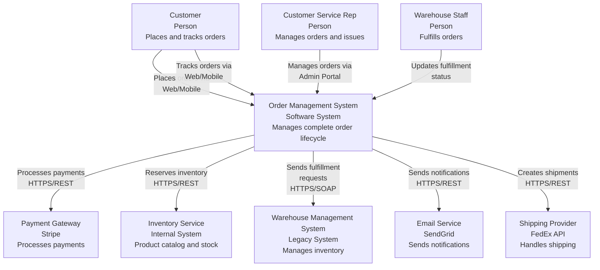
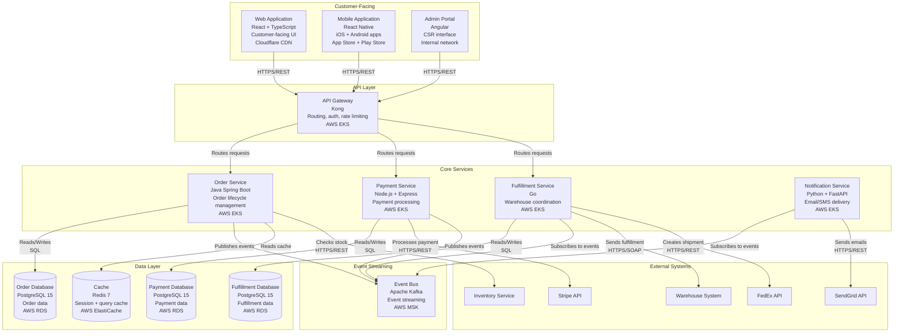
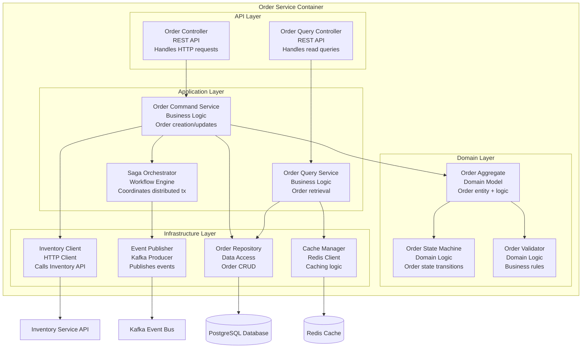

# Order Management System - Architecture Documentation (C4 Model)

**Version**: 2.0  
**Date**: 2024-10-25  
**Author**: Enterprise Architecture Team  
**Status**: Approved  
**Last Review**: 2024-10-20

---

## Document Overview

### Purpose
This document describes the architecture of the Order Management System (OMS), a microservices-based platform that handles the complete order lifecycle from creation to fulfillment for our e-commerce business.

### Scope
This documentation covers:
- System context and boundaries
- Container-level architecture
- Component structure of core services
- Technology choices and rationale
- Integration patterns

Out of scope:
- Detailed API specifications (see API documentation)
- Infrastructure-as-code details (see DevOps documentation)
- Operational runbooks (see Operations wiki)

### Audience
- Software Architects evaluating design decisions
- Senior Developers implementing new features
- Operations team deploying and maintaining the system
- Product Managers understanding technical capabilities
- Technical stakeholders in business discussions

### Definitions
- **OMS**: Order Management System
- **SKU**: Stock Keeping Unit
- **Fulfillment**: Process of preparing and shipping orders
- **Idempotency**: Ability to safely retry operations without side effects

---

## 1. System Context

### Overview

The Order Management System is the core platform managing all customer orders from creation through fulfillment. It orchestrates payment processing, inventory allocation, and shipment coordination while providing real-time order tracking to customers.

**Key Capabilities**:
- Order creation and validation
- Payment processing with multiple providers
- Inventory reservation and allocation
- Fulfillment coordination with warehouses
- Order tracking and notifications
- Returns and refunds management

### Context Diagram



### Actors

#### Customer
**Role**: End user purchasing products  
**Interactions**:
- Creates orders through web or mobile applications
- Tracks order status in real-time
- Requests returns or modifications
- Receives email/SMS notifications

**Volume**: ~50,000 orders/day, peaks at 200,000 during promotions

#### Customer Service Representative
**Role**: Internal staff handling customer issues  
**Interactions**:
- Views complete order history
- Processes refunds and cancellations
- Updates order information
- Escalates fulfillment issues

**Volume**: ~500 CSRs, handling ~5,000 tickets/day

#### Warehouse Staff
**Role**: Personnel fulfilling physical orders  
**Interactions**:
- Receives pick lists from OMS
- Updates fulfillment status
- Reports inventory issues
- Triggers shipment creation

**Volume**: 3 warehouses, ~200 staff total

### External Systems

#### Payment Gateway (Stripe)
**Purpose**: Credit card and alternative payment processing  
**Integration**: HTTPS/REST API  
**Critical**: Yes (orders can't complete without payment)  
**SLA**: 99.99% uptime, <500ms response time

**Key Interactions**:
- Process payment on order creation
- Handle refunds for cancellations
- Store payment methods for subscriptions
- Webhook notifications for payment events

#### Warehouse Management System (WMS)
**Purpose**: Legacy system managing physical inventory and fulfillment  
**Integration**: HTTPS/SOAP (legacy protocol)  
**Critical**: Yes (orders can't be fulfilled)  
**Constraints**: 
- Read-only access to inventory
- Batch updates every 15 minutes
- Cannot be modified (vendor-managed)

**Key Interactions**:
- Send fulfillment requests
- Receive inventory availability updates
- Get shipment tracking updates
- Handle fulfillment exceptions

#### Email Service (SendGrid)
**Purpose**: Transactional email delivery  
**Integration**: HTTPS/REST API  
**Critical**: No (orders can proceed without emails)  
**SLA**: Best effort, ~99% delivery rate

**Key Interactions**:
- Order confirmation emails
- Shipment tracking emails
- Cancellation/refund notifications
- Delivery notifications

#### Shipping Provider (FedEx API)
**Purpose**: Shipment creation and tracking  
**Integration**: HTTPS/REST API  
**Critical**: Yes (orders can't ship without labels)  
**Constraints**: Rate limits (100 requests/minute)

**Key Interactions**:
- Create shipping labels
- Track shipments in real-time
- Calculate shipping costs
- Handle address validation

#### Inventory Service
**Purpose**: Internal service providing product catalog and stock levels  
**Integration**: HTTPS/REST API + Kafka events  
**Critical**: Yes (orders need inventory validation)  
**Owned by**: Product Platform Team

**Key Interactions**:
- Check product availability
- Reserve inventory on order creation
- Release inventory on cancellation
- Receive real-time stock updates via Kafka

---

## 2. Container Architecture

### Overview

The OMS uses a microservices architecture with event-driven communication. Core services are independently deployable, scalable, and maintainable. Services communicate synchronously via REST APIs for request-response patterns and asynchronously via Kafka for event-driven workflows.

### Container Diagram



### Container Descriptions

#### Web Application
**Technology**: React 18, TypeScript, Vite  
**Hosting**: Cloudflare Pages with CDN  
**Purpose**: Customer-facing interface for browsing, ordering, and tracking

**Responsibilities**:
- Render product catalog and cart
- Handle checkout flow
- Display order status and history
- Provide order tracking interface
- Implement responsive design for mobile browsers

**Non-Responsibilities**:
- No business logic (thin client)
- No direct database access
- No payment processing (delegates to backend)

**Scalability**: Horizontal via CDN, globally distributed

#### Mobile Application
**Technology**: React Native, TypeScript  
**Platforms**: iOS 15+, Android 11+  
**Purpose**: Native mobile experience for customers

**Responsibilities**:
- Native UI/UX for mobile devices
- Push notifications for order updates
- Offline order viewing (cached data)
- Biometric authentication
- Deep linking for order tracking

**Distribution**: App Store and Google Play Store

#### Admin Portal
**Technology**: Angular 16, TypeScript  
**Hosting**: Internal AWS environment  
**Purpose**: CSR interface for order management

**Responsibilities**:
- Search and view orders
- Process refunds and cancellations
- Update order information
- View customer history
- Generate reports

**Security**: Internal network only, VPN required

#### API Gateway (Kong)
**Technology**: Kong Gateway 3.x  
**Hosting**: AWS EKS (3 replicas minimum)  
**Purpose**: Single entry point for all API traffic

**Responsibilities**:
- Route requests to appropriate services
- JWT authentication and validation
- Rate limiting (tier-based: 100/1000/10000 req/hour)
- Request/response transformation
- API analytics and logging
- CORS handling

**Plugins Enabled**:
- jwt-auth
- rate-limiting
- request-transformer
- prometheus (metrics)
- correlation-id

#### Order Service
**Technology**: Java 17, Spring Boot 3, Spring Data JPA  
**Hosting**: AWS EKS (autoscaling 3-20 pods)  
**Purpose**: Core service managing order lifecycle

**Responsibilities**:
- Create and validate orders
- Orchestrate order workflow (Saga pattern)
- Manage order state machine
- Handle order modifications and cancellations
- Provide order query API
- Implement idempotency for order creation

**Key Patterns**:
- Domain-Driven Design (Order aggregate)
- Event Sourcing for order history
- Saga pattern for distributed transactions
- CQRS (separate read/write models)

**Database**: PostgreSQL with partitioning by date (monthly partitions)

**Performance**:
- Target: p95 <200ms for order creation
- Target: p95 <50ms for order queries
- Caching: Redis for frequent queries

#### Payment Service
**Technology**: Node.js 20, Express, TypeScript  
**Hosting**: AWS EKS (autoscaling 2-10 pods)  
**Purpose**: Handle all payment processing

**Responsibilities**:
- Process payments via Stripe
- Store payment methods securely (PCI compliant)
- Handle refunds and voids
- Implement 3D Secure for card payments
- Retry failed payments with exponential backoff
- Payment reconciliation

**Security**:
- No raw card data stored (Stripe tokens only)
- PCI DSS Level 1 compliant
- Encryption at rest and in transit
- Audit logging for all payment events

**Database**: PostgreSQL with encryption at rest

#### Fulfillment Service
**Technology**: Go 1.21  
**Hosting**: AWS EKS (autoscaling 2-15 pods)  
**Purpose**: Coordinate order fulfillment with warehouses

**Responsibilities**:
- Send fulfillment requests to WMS
- Track fulfillment status
- Handle fulfillment exceptions
- Create shipping labels via FedEx
- Update order tracking information
- Manage inventory allocation

**Integration Challenges**:
- WMS uses legacy SOAP API
- 15-minute batch updates from WMS
- No real-time inventory visibility
- Manual retry for failed fulfillment requests

**Compensating Actions**:
- Polling WMS every 5 minutes for status
- Local cache of WMS responses
- Webhook fallback for FedEx tracking

#### Notification Service
**Technology**: Python 3.11, FastAPI  
**Hosting**: AWS EKS (autoscaling 2-8 pods)  
**Purpose**: Handle all customer notifications

**Responsibilities**:
- Send order confirmation emails
- Send shipment tracking emails
- Send cancellation/refund notifications
- Handle email failures and retries
- Template management
- Personalization logic

**Event-Driven**: Consumes events from Kafka, no synchronous dependencies

**Failure Handling**:
- Dead letter queue for failed sends
- Retry with exponential backoff
- Fallback to SMS if email fails repeatedly

---

## 3. Component View: Order Service

### Purpose

The Order Service is the heart of the OMS, managing the complete order lifecycle. This section details its internal structure.

### Component Diagram



### Component Descriptions

#### Order Controller
**Type**: REST Controller  
**Responsibilities**:
- Handle HTTP POST /orders (create order)
- Handle HTTP PUT /orders/{id} (update order)
- Handle HTTP DELETE /orders/{id} (cancel order)
- Request validation and error handling
- DTO to domain model conversion

**Endpoints**:
```
POST   /api/v1/orders              Create order
PUT    /api/v1/orders/{id}         Update order
DELETE /api/v1/orders/{id}         Cancel order
POST   /api/v1/orders/{id}/items   Add item to order
```

#### Order Query Controller
**Type**: REST Controller (Read-Only)  
**Responsibilities**:
- Handle HTTP GET /orders (list orders)
- Handle HTTP GET /orders/{id} (get order detail)
- Pagination and filtering
- Response caching headers

**Endpoints**:
```
GET /api/v1/orders                 List orders (paginated)
GET /api/v1/orders/{id}            Get order by ID
GET /api/v1/orders/user/{userId}   Get orders by user
GET /api/v1/orders/{id}/history    Get order event history
```

#### Order Command Service
**Type**: Application Service  
**Responsibilities**:
- Orchestrate order creation workflow
- Apply business rules via validators
- Check inventory availability
- Initiate Saga for distributed transaction
- Implement idempotency (idempotency key)
- Handle order updates and cancellations

**Key Methods**:
- `createOrder(OrderCreateRequest): Order`
- `updateOrder(orderId, OrderUpdateRequest): Order`
- `cancelOrder(orderId, reason): void`
- `addItem(orderId, item): Order`

#### Order Query Service
**Type**: Application Service (Read-Only)  
**Responsibilities**:
- Retrieve orders with caching
- Implement pagination and filtering
- Join data from multiple sources if needed
- Cache warming for hot queries

**Key Methods**:
- `getOrderById(orderId): Order`
- `getOrdersByUser(userId, pagination): List<Order>`
- `searchOrders(criteria): List<Order>`

#### Saga Orchestrator
**Type**: Workflow Engine  
**Responsibilities**:
- Coordinate distributed transaction across services
- Implement compensation logic for failures
- Maintain saga state
- Publish events for each saga step
- Handle timeouts and retries

**Saga Steps for Order Creation**:
1. Reserve inventory (InventoryService)
2. Process payment (PaymentService)
3. Request fulfillment (FulfillmentService)
4. Complete order or compensate on failure

#### Order Aggregate
**Type**: Domain Model (DDD Aggregate Root)  
**Responsibilities**:
- Encapsulate order data and invariants
- Enforce business rules
- Manage order line items
- Calculate order totals
- Generate domain events

**Key Invariants**:
- Order total = sum of line items + shipping + tax
- Cannot add items to order in "Shipped" status
- Cannot cancel order after fulfillment started

#### Order State Machine
**Type**: Domain Logic  
**Responsibilities**:
- Define valid order states
- Define valid transitions between states
- Validate state transitions
- Trigger side effects on state changes

**States**:
```
PENDING → PAYMENT_PROCESSING → PAYMENT_COMPLETED → 
FULFILLMENT_PENDING → FULFILLMENT_IN_PROGRESS → 
SHIPPED → DELIVERED

Alternate paths:
→ PAYMENT_FAILED
→ CANCELLED
→ REFUNDED
```

#### Order Validator
**Type**: Domain Logic  
**Responsibilities**:
- Validate order data
- Check business rules
- Validate addresses
- Validate product availability
- Enforce minimum order value

**Validation Rules**:
- Order must have at least 1 item
- Shipping address must be valid
- All SKUs must exist in catalog
- Order total must be > $5

#### Order Repository
**Type**: Data Access  
**Responsibilities**:
- CRUD operations for Order aggregate
- Database transaction management
- Optimistic locking for concurrent updates
- Query optimization

**Technology**: Spring Data JPA with custom queries

#### Event Publisher
**Type**: Infrastructure (Kafka Producer)  
**Responsibilities**:
- Publish domain events to Kafka
- Ensure at-least-once delivery
- Handle serialization to Avro
- Implement outbox pattern for reliability

**Published Events**:
- OrderCreated
- OrderUpdated
- OrderCancelled
- OrderPaymentCompleted
- OrderShipped
- OrderDelivered

#### Inventory Client
**Type**: HTTP Client  
**Responsibilities**:
- Call Inventory Service API
- Handle timeouts and retries
- Circuit breaker pattern
- Response caching

**Technology**: Resilience4j for resilience patterns

#### Cache Manager
**Type**: Infrastructure (Redis Client)  
**Responsibilities**:
- Cache frequent queries
- Implement cache-aside pattern
- Handle cache invalidation
- TTL management

**Cached Data**:
- Order details (TTL: 5 minutes)
- User order lists (TTL: 2 minutes)
- Order counts (TTL: 30 seconds)

---

## 4. Key Architectural Decisions

### Event-Driven Architecture
**Decision**: Use Kafka for asynchronous communication between services  
**Rationale**: Loose coupling, scalability, audit trail  
**Trade-off**: Eventual consistency, increased complexity  
**Reference**: ADR-012

### Saga Pattern
**Decision**: Orchestration-based Saga for order creation  
**Rationale**: Clear workflow visualization, easier debugging  
**Alternative**: Choreography (rejected - harder to understand)  
**Reference**: ADR-014

### Database per Service
**Decision**: Each microservice has its own PostgreSQL database  
**Rationale**: Service autonomy, independent scaling  
**Trade-off**: No foreign keys across services, need for data replication  
**Reference**: ADR-009

### Technology Diversity
**Decision**: Different languages per service (Java, Node.js, Go, Python)  
**Rationale**: Use best tool for each job, team expertise  
**Trade-off**: Increased operational complexity, need for polyglot tooling  
**Reference**: ADR-007

---

## 5. Quality Attributes

### Performance
- **Target**: p95 < 200ms for order creation
- **Current**: p95 = 180ms
- **Approach**: Caching, async processing, database indexing

### Scalability
- **Target**: Handle 200K orders/day (4x current)
- **Approach**: Horizontal pod autoscaling, Kafka partitioning, database sharding (future)

### Availability
- **Target**: 99.95% uptime (4.4 hours downtime/year)
- **Approach**: Multi-AZ deployment, circuit breakers, graceful degradation

### Security
- **Approach**: JWT authentication, TLS everywhere, secrets management (AWS Secrets Manager), audit logging

### Resilience
- **Patterns**: Circuit breaker, retry with backoff, bulkhead, timeout

---

## 6. Deployment

- **Platform**: AWS EKS (Kubernetes)
- **Regions**: us-east-1 (primary), us-west-2 (DR)
- **CI/CD**: GitHub Actions → ECR → ArgoCD
- **Monitoring**: Datadog, CloudWatch, Prometheus

---

## 7. References

- [ADR-007: Polyglot Microservices](../01-adr-generator/examples/example-microservices-adr.md)
- [ADR-009: Database per Service]
- [ADR-012: Event-Driven Architecture]
- [ADR-014: Saga Pattern for Distributed Transactions]
- [C4 Model Documentation](https://c4model.com)

---

## Appendix A: Revision History

| Version | Date | Author | Changes |
|---------|------|--------|---------|
| 1.0 | 2024-06-15 | Architecture Team | Initial version |
| 1.5 | 2024-09-10 | J. Smith | Added Fulfillment Service |
| 2.0 | 2024-10-25 | Architecture Team | Complete rewrite with C4 Model |