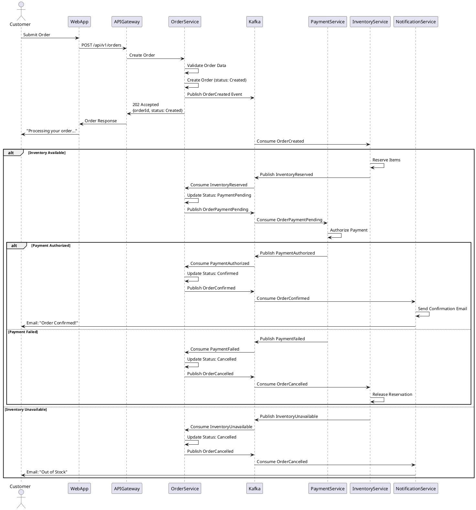
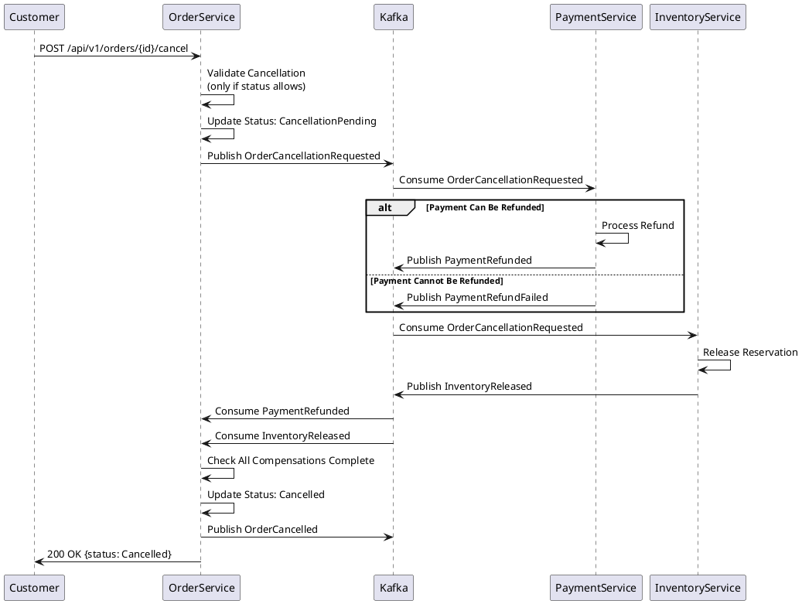

# 4+1 Architectural Views - E-commerce Platform Example

## Document Information

**System**: E-commerce Order Management Platform
**Version**: 2.0
**Date**: 2024-11-08
**Authors**: Architecture Team
**Status**: Approved

---

## Table of Contents

1. [Introduction](#introduction)
2. [Logical View](#logical-view)
3. [Process View](#process-view)
4. [Development View](#development-view)
5. [Physical View](#physical-view)
6. [Scenarios (+1 View)](#scenarios-1-view)
7. [Architectural Decisions](#architectural-decisions)

---

## Introduction

This document describes the architecture of the E-commerce Order Management Platform using the 4+1 architectural view model proposed by Philippe Kruchten. The 4+1 views organize architectural information to address the concerns of different stakeholders.

### System Overview

**Mission**: Process customer orders from placement through fulfillment, handling payments, inventory coordination, and shipping integration.

**Key Capabilities**:

- Order placement and management (100K orders/day target)
- Multi-provider payment processing (Stripe, PayPal, Adyen)
- Real-time inventory coordination with warehouses
- Shipping integration with major carriers (FedEx, UPS, DHL)
- Customer notifications (email, SMS)
- Order tracking and customer service tools

### Architectural Approach

**Style**: Event-driven microservices architecture with CQRS for order management

**Key Design Principles**:

1. **Bounded Contexts**: Services aligned with business domains (DDD)
2. **Eventual Consistency**: Accept temporary inconsistency for availability
3. **Resilience**: Circuit breakers, bulkheads, graceful degradation
4. **Observability**: Distributed tracing, structured logging, metrics
5. **API-First**: Well-defined contracts, versioning strategy

---

## 1. Logical View

**Audience**: End users, business analysts, product managers
**Purpose**: Describes system functionality and key abstractions
**Focus**: What the system does

### 1.1 Domain Model

#### Core Aggregates

```
Order Aggregate:
├── Order (Root)
│   ├── orderId: UUID
│   ├── orderNumber: String
│   ├── customerId: UUID
│   ├── status: OrderStatus
│   ├── totalAmount: Money
│   ├── createdAt: DateTime
│   └── items: List<OrderItem>
│
├── OrderItem (Entity)
│   ├── itemId: UUID
│   ├── productId: UUID
│   ├── sku: String
│   ├── quantity: Integer
│   └── unitPrice: Money
│
└── ShippingInfo (Value Object)
    ├── address: Address
    ├── method: ShippingMethod
    └── trackingNumber: String (optional)

Payment Aggregate:
├── Payment (Root)
│   ├── paymentId: UUID
│   ├── orderId: UUID
│   ├── amount: Money
│   ├── status: PaymentStatus
│   └── method: PaymentMethod
│
└── PaymentMethod (Value Object)
    ├── type: [Card, PayPal, ApplePay]
    └── details: Map<String, String>

Inventory Aggregate:
├── InventoryReservation (Root)
│   ├── reservationId: UUID
│   ├── orderId: UUID
│   ├── items: List<ReservedItem>
│   ├── status: ReservationStatus
│   └── expiresAt: DateTime
│
└── ReservedItem (Entity)
    ├── productId: UUID
    ├── quantity: Integer
    └── warehouseId: UUID
```

#### Domain Events

```
Order Domain Events:
- OrderCreated
- OrderConfirmed
- OrderShipped
- OrderDelivered
- OrderCancelled

Payment Domain Events:
- PaymentAuthorized
- PaymentCaptured
- PaymentFailed
- PaymentRefunded

Inventory Domain Events:
- InventoryReserved
- InventoryReleased
- InventoryUnavailable
```

### 1.2 Bounded Contexts

```
┌─────────────────────────────────────────────────────────────┐
│                    E-commerce Platform                       │
│                                                              │
│  ┌──────────────┐  ┌──────────────┐  ┌─────────────────┐   │
│  │    Order     │  │   Payment    │  │   Inventory     │   │
│  │   Context    │  │   Context    │  │    Context      │   │
│  │              │  │              │  │                 │   │
│  │ - Order      │  │ - Payment    │  │ - Reservation   │   │
│  │ - OrderItem  │  │ - Refund     │  │ - Stock         │   │
│  │ - Customer   │  │ - Gateway    │  │ - Warehouse     │   │
│  └──────────────┘  └──────────────┘  └─────────────────┘   │
│         │                 │                    │            │
│         └─────────────────┴────────────────────┘            │
│                           │                                 │
│  ┌──────────────┐  ┌──────────────┐  ┌─────────────────┐   │
│  │   Shipping   │  │ Notification │  │    Customer     │   │
│  │   Context    │  │   Context    │  │    Context      │   │
│  │              │  │              │  │                 │   │
│  │ - Shipment   │  │ - Template   │  │ - Profile       │   │
│  │ - Carrier    │  │ - Channel    │  │ - Address       │   │
│  │ - Tracking   │  │ - Delivery   │  │ - PaymentMethod │   │
│  └──────────────┘  └──────────────┘  └─────────────────┘   │
│                                                              │
└─────────────────────────────────────────────────────────────┘
```

### 1.3 Context Map

**Relationships Between Contexts**:

```
Order Context → Payment Context (Customer/Supplier)
- Order Context needs payment processing
- Payment Context exposes Payment API
- Integration: REST API + Domain Events

Order Context → Inventory Context (Customer/Supplier)
- Order Context needs inventory reservation
- Inventory Context exposes Reservation API
- Integration: Async Events via Kafka

Order Context → Notification Context (Customer/Supplier)
- Order Context triggers notifications
- Notification Context sends emails/SMS
- Integration: Async Events via Kafka

Shipping Context → Order Context (Conformist)
- Shipping Context consumes Order events
- Shipping Context adapts to Order's model
- Integration: Async Events via Kafka

All Contexts → Customer Context (Shared Kernel)
- Customer data referenced across contexts
- Customer Context publishes reference data
- Integration: Event-driven cache synchronization
```

### 1.4 Key Abstractions

#### Order Lifecycle State Machine

```
[Created] → [PaymentPending] → [PaymentAuthorized] → [Confirmed]
                  ↓                      ↓                 ↓
              [Cancelled]           [Cancelled]       [Processing]
                                                          ↓
                                                    [Shipped]
                                                          ↓
                                                    [Delivered]
                                                          ↓
                                                    [Completed]

Cancellation possible from: Created, PaymentPending, PaymentAuthorized, Confirmed
Refund triggers: Any state after PaymentAuthorized
```

#### Payment Processing Flow

```
1. Authorize: Reserve funds on customer's payment method
2. Capture: Actually charge the customer (triggered by order confirmation)
3. Settle: Funds transferred to merchant account (handled by provider)

Alternative Flows:
- Authorize → Void: Cancel authorization before capture
- Capture → Refund: Return funds to customer
```

---

## 2. Process View

**Audience**: System engineers, integrators
**Purpose**: Describes runtime behavior, concurrency, and communication
**Focus**: How the system runs

### 2.1 Key Processes

#### Process 1: Order Placement

**Participants**: Web App, API Gateway, Order Service, Payment Service, Inventory Service, Notification Service

**Sequence**:



**Concurrency**: Order Service handles 200 concurrent order placements

**Performance Targets**:

- API response time: < 200ms (returns immediately after publishing event)
- End-to-end order confirmation: < 5 seconds (p95)

**Error Handling**:

- Payment Service unavailable: Retry 3 times with exponential backoff, then fail order
- Inventory Service unavailable: Order stays in Created status, processes when service recovers (eventual consistency)

#### Process 2: Order Cancellation with Compensation

**Type**: Choreography-based Saga

**Sequence**:



### 2.2 Concurrency Management

**Order Service**:

- HTTP Request Pool: 100 threads (Tomcat default)
- Kafka Consumer Pool: 10 threads (one per partition)
- Async Task Pool: 20 threads (for background jobs)

**Payment Service**:

- HTTP Request Pool: 50 threads
- Kafka Consumer Pool: 5 threads
- Payment Gateway Client Pool: 30 threads (one per concurrent gateway call)

### 2.3 Scalability

**Horizontal Scaling**:

- Order Service: 4 instances (auto-scale 2-12 based on CPU)
- Payment Service: 3 instances (auto-scale 2-8)
- Inventory Service: 3 instances (auto-scale 2-10)

**Kafka Partitioning**:

- orders.created: 10 partitions (partitioned by orderId hash)
- payments.authorized: 5 partitions (partitioned by paymentId hash)
- inventory.reserved: 8 partitions (partitioned by orderId hash)

**Database Scaling**:

- Read replicas: 2 per service (route read queries to replicas)
- Connection pooling: HikariCP with max 20 connections per instance

---

## 3. Development View

**Audience**: Developers, architects
**Purpose**: Describes code organization, modules, dependencies
**Focus**: How the system is built

### 3.1 Layered Architecture (per Service)

```txt
┌─────────────────────────────────────────┐
│          API Layer (REST/gRPC)          │  ← External interface
├─────────────────────────────────────────┤
│       Application Service Layer         │  ← Use cases, orchestration
├─────────────────────────────────────────┤
│           Domain Layer                  │  ← Business logic
│  (Aggregates, Entities, Value Objects)  │
├─────────────────────────────────────────┤
│        Infrastructure Layer             │  ← Technical concerns
│  (Persistence, Messaging, External APIs)│
└─────────────────────────────────────────┘

Dependency Rule: Inner layers don't depend on outer layers
Domain layer has ZERO dependencies on infrastructure
```

### 3.3 Dependency Management

```
┌──────────────┐     ┌──────────────┐     ┌──────────────┐
│    Order     │────>│   Payment    │     │  Inventory   │
│   Service    │     │   Service    │     │   Service    │
└──────┬───────┘     └──────┬───────┘     └──────┬───────┘
       │                    │                    │
       │                    │                    │
       └────────────────────┴────────────────────┘
                           │
                    ┌──────▼───────┐
                    │  Shared      │
                    │  Kernel      │
                    └──────────────┘
                           │
                    ┌──────▼───────┐
                    │  Platform    │
                    │  Commons     │
                    └──────────────┘

Dependency Rule: Services don't depend on each other's code
Communication only via API/Events
```

### 3.4 Testing Strategy

#### Test Pyramid

```
          /\
         /  \  E2E Tests (5%)
        /────\  - Full system tests
       /      \  - Critical user journeys
      /────────\  Contract Tests (15%)
     /          \ - Pact consumer/provider tests
    /────────────\ Integration Tests (30%)
   /              \ - Testcontainers
  /────────────────\ - API tests with real DB/Kafka
 /                  \ Unit Tests (50%)
/────────────────────\ - Domain logic
                       - Service layer
```

#### Test Organization

```
src/test/java/com/ecommerce/order
├── unit
│   ├── domain
│   │   ├── OrderTest.java
│   │   └── OrderItemTest.java
│   └── service
│       └── OrderServiceTest.java
├── integration
│   ├── api
│   │   └── OrderControllerIntegrationTest.java
│   ├── repository
│   │   └── OrderRepositoryIntegrationTest.java
│   └── messaging
│       └── OrderEventPublisherIntegrationTest.java
├── contract
│   └── pact
│       └── OrderServiceProviderPactTest.java
└── e2e
    └── OrderPlacementE2ETest.java
```

### 3.5 Code Quality Gates

**SonarQube Quality Gates**:

- Code Coverage: > 80%
- Duplicated Lines: < 3%
- Maintainability Rating: A
- Reliability Rating: A
- Security Rating: A
- Technical Debt Ratio: < 5%

**Enforcement**:

- CI pipeline fails if quality gates not met
- Code review required before merge
- ArchUnit tests enforce architecture rules

---

## 4. Physical View

**Audience**: System engineers, DevOps, operations
**Purpose**: Describes deployment topology, infrastructure
**Focus**: Where the system runs

### 4.1 Deployment Architecture

#### Production Environment (AWS)

```
┌─────────────────────────────────────────────────────────────────┐
│                      AWS Cloud (us-east-1)                       │
│                                                                  │
│  ┌────────────────── VPC (10.0.0.0/16) ──────────────────────┐  │
│  │                                                             │  │
│  │  ┌─── Public Subnet (10.0.1.0/24) ───┐                    │  │
│  │  │                                    │                    │  │
│  │  │  ┌──────────────┐  ┌─────────────┐│                    │  │
│  │  │  │   ALB        │  │  CloudFront ││                    │  │
│  │  │  │ (Port 443)   │  │   CDN       ││                    │  │
│  │  │  └──────┬───────┘  └─────────────┘│                    │  │
│  │  └─────────┼──────────────────────────┘                    │  │
│  │            │                                               │  │
│  │  ┌─────────▼─── Private Subnet (10.0.2.0/24) ──────────┐  │  │
│  │  │                                                       │  │  │
│  │  │        EKS Cluster (Kubernetes 1.28)                 │  │  │
│  │  │  ┌──────────────────────────────────────────┐        │  │  │
│  │  │  │  Node Group: order-service (3 nodes)     │        │  │  │
│  │  │  │  ├── order-service-pod-1 (2 CPU, 4GB)    │        │  │  │
│  │  │  │  ├── order-service-pod-2                 │        │  │  │
│  │  │  │  └── order-service-pod-3                 │        │  │  │
│  │  │  └──────────────────────────────────────────┘        │  │  │
│  │  │  ┌──────────────────────────────────────────┐        │  │  │
│  │  │  │  Node Group: payment-service (2 nodes)   │        │  │  │
│  │  │  │  ├── payment-service-pod-1 (1 CPU, 2GB)  │        │  │  │
│  │  │  │  └── payment-service-pod-2                │        │  │  │
│  │  │  └──────────────────────────────────────────┘        │  │  │
│  │  │  ┌──────────────────────────────────────────┐        │  │  │
│  │  │  │  Node Group: inventory-service (2 nodes) │        │  │  │
│  │  │  └──────────────────────────────────────────┘        │  │  │
│  │  └───────────────────────────────────────────────────────┘  │  │
│  │                                                             │  │
│  │  ┌─── Data Subnet (10.0.3.0/24) ─────────────┐            │  │
│  │  │                                            │            │  │
│  │  │  ┌───────────────────────────────────┐    │            │  │
│  │  │  │  RDS PostgreSQL (Multi-AZ)        │    │            │  │
│  │  │  │  ├── orders_db (db.r5.xlarge)     │    │            │  │
│  │  │  │  ├── payments_db (db.r5.large)    │    │            │  │
│  │  │  │  └── inventory_db (db.r5.large)   │    │            │  │
│  │  │  └───────────────────────────────────┘    │            │  │
│  │  │                                            │            │  │
│  │  │  ┌───────────────────────────────────┐    │            │  │
│  │  │  │  ElastiCache Redis Cluster        │    │            │  │
│  │  │  │  (3 nodes, cache.r5.large)        │    │            │  │
│  │  │  └───────────────────────────────────┘    │            │  │
│  │  │                                            │            │  │
│  │  │  ┌───────────────────────────────────┐    │            │  │
│  │  │  │  MSK (Managed Kafka)              │    │            │  │
│  │  │  │  (5 brokers, kafka.m5.large)      │    │            │  │
│  │  │  └───────────────────────────────────┘    │            │  │
│  │  └────────────────────────────────────────────┘            │  │
│  └─────────────────────────────────────────────────────────────┘  │
│                                                                  │
│  ┌─── External Services ───┐                                    │
│  │  - Stripe API (Payment) │                                    │
│  │  - SendGrid (Email)     │                                    │
│  │  - Twilio (SMS)         │                                    │
│  │  - FedEx API (Shipping) │                                    │
│  └─────────────────────────┘                                    │
│                                                                  │
│  ┌─── Observability ───────┐                                    │
│  │  - Datadog (Metrics)    │                                    │
│  │  - ELK Stack (Logs)     │                                    │
│  │  - Jaeger (Tracing)     │                                    │
│  └─────────────────────────┘                                    │
└──────────────────────────────────────────────────────────────────┘
```

### 4.2 Infrastructure Components

#### Compute Resources

| Component | Instance Type | Count | CPU | Memory | Purpose |
|-----------|--------------|-------|-----|--------|---------|
| EKS Worker Nodes | m5.xlarge | 8 | 4 vCPU | 16 GB | Kubernetes nodes |
| ALB | - | 1 | - | - | Load balancing |
| NAT Gateway | - | 2 | - | - | Outbound internet |

#### Data Storage

| Component | Instance Type | Storage | Purpose |
|-----------|--------------|---------|---------|
| RDS PostgreSQL (orders) | db.r5.xlarge | 1 TB SSD | Order data |
| RDS PostgreSQL (payments) | db.r5.large | 500 GB SSD | Payment records |
| RDS PostgreSQL (inventory) | db.r5.large | 300 GB SSD | Inventory reservations |
| ElastiCache Redis | cache.r5.large | - | Session, cache |
| MSK (Kafka) | kafka.m5.large | 2 TB per broker | Event streaming |
| S3 Buckets | - | Unlimited | Backups, logs, documents |

#### Network Configuration

**VPC Subnets**:

- **Public Subnet** (10.0.1.0/24): ALB, NAT Gateway, Bastion Host
- **Private Subnet** (10.0.2.0/24): EKS worker nodes, application pods
- **Data Subnet** (10.0.3.0/24): RDS, ElastiCache, MSK (no internet access)

**Security Groups**:

```
ALB Security Group:
  Inbound:
    - Port 443 (HTTPS) from 0.0.0.0/0 (Internet)
  Outbound:
    - Port 8080 to EKS Security Group

EKS Security Group:
  Inbound:
    - Port 8080 from ALB Security Group
    - Port 8080 from EKS Security Group (pod-to-pod)
  Outbound:
    - Port 5432 to RDS Security Group
    - Port 6379 to Redis Security Group
    - Port 9092 to MSK Security Group
    - Port 443 to 0.0.0.0/0 (external APIs)

RDS Security Group:
  Inbound:
    - Port 5432 from EKS Security Group
  Outbound: None

Redis Security Group:
  Inbound:
    - Port 6379 from EKS Security Group
  Outbound: None

MSK Security Group:
  Inbound:
    - Port 9092 from EKS Security Group
  Outbound: None
```

### 4.3 Deployment Topology

#### Multi-Region Setup

**Primary Region**: us-east-1 (North Virginia)

- All services active
- Handles 100% production traffic
- Primary databases with Multi-AZ

**Secondary Region**: us-west-2 (Oregon) - Disaster Recovery

- Services deployed but idle (warm standby)
- Read replicas for databases (async replication)
- Activated manually in DR scenario
- RTO: 1 hour, RPO: 5 minutes

#### Service Deployment Strategy

**Kubernetes Deployment Configuration**:

```yaml
# order-service deployment
apiVersion: apps/v1
kind: Deployment
metadata:
  name: order-service
  namespace: production
spec:
  replicas: 3
  strategy:
    type: RollingUpdate
    rollingUpdate:
      maxUnavailable: 1
      maxSurge: 1
  selector:
    matchLabels:
      app: order-service
  template:
    metadata:
      labels:
        app: order-service
        version: v2.0
    spec:
      containers:
      - name: order-service
        image: ecr.amazonaws.com/order-service:2.0.45
        ports:
        - containerPort: 8080
        resources:
          requests:
            cpu: 1000m
            memory: 2Gi
          limits:
            cpu: 2000m
            memory: 4Gi
        livenessProbe:
          httpGet:
            path: /actuator/health/liveness
            port: 8080
          initialDelaySeconds: 60
          periodSeconds: 10
        readinessProbe:
          httpGet:
            path: /actuator/health/readiness
            port: 8080
          initialDelaySeconds: 30
          periodSeconds: 5
        env:
        - name: SPRING_PROFILES_ACTIVE
          value: production
        - name: DATABASE_URL
          valueFrom:
            secretKeyRef:
              name: order-db-secret
              key: url
        - name: KAFKA_BROKERS
          value: "kafka-broker-1:9092,kafka-broker-2:9092"
```

### 4.4 Scaling Strategy

#### Horizontal Pod Autoscaling (HPA)

```yaml
apiVersion: autoscaling/v2
kind: HorizontalPodAutoscaler
metadata:
  name: order-service-hpa
spec:
  scaleTargetRef:
    apiVersion: apps/v1
    kind: Deployment
    name: order-service
  minReplicas: 3
  maxReplicas: 12
  metrics:
  - type: Resource
    resource:
      name: cpu
      target:
        type: Utilization
        averageUtilization: 70
  - type: Resource
    resource:
      name: memory
      target:
        type: Utilization
        averageUtilization: 80
  behavior:
    scaleUp:
      stabilizationWindowSeconds: 60
      policies:
      - type: Percent
        value: 50
        periodSeconds: 60
    scaleDown:
      stabilizationWindowSeconds: 300
      policies:
      - type: Pods
        value: 1
        periodSeconds: 180
```

**Scaling Thresholds**:

- **Order Service**: CPU > 70% → scale from 3 to 12 pods
- **Payment Service**: CPU > 70% → scale from 2 to 8 pods
- **Inventory Service**: CPU > 70% → scale from 2 to 10 pods

#### Database Scaling

**Read Scaling**:

- 2 read replicas per database
- Read queries routed to replicas via pgpool
- Replication lag monitored (alert if > 1 second)

**Write Scaling**:

- Vertical scaling: Upgrade instance type (db.r5.xlarge → db.r5.2xlarge)
- Connection pooling: HikariCP with max 20 connections per pod
- Partitioning: orders table partitioned by created_at (monthly partitions)

### 4.5 High Availability

#### Availability Zones

**Distribution**:

- EKS nodes: Distributed across 3 AZs (us-east-1a, us-east-1b, us-east-1c)
- RDS: Multi-AZ with automatic failover
- ElastiCache: 3 nodes across 3 AZs
- MSK: 5 brokers across 3 AZs (at least 2 per AZ)

**Pod Anti-Affinity**:

```yaml
affinity:
  podAntiAffinity:
    preferredDuringSchedulingIgnoredDuringExecution:
    - weight: 100
      podAffinityTerm:
        labelSelector:
          matchLabels:
            app: order-service
        topologyKey: topology.kubernetes.io/zone
```

#### Circuit Breakers & Bulkheads

**Resilience4j Configuration**:

```yaml
resilience4j:
  circuitbreaker:
    instances:
      payment-gateway:
        slidingWindowSize: 10
        failureRateThreshold: 50
        waitDurationInOpenState: 10000
        permittedNumberOfCallsInHalfOpenState: 3
        automaticTransitionFromOpenToHalfOpenEnabled: true
  
  bulkhead:
    instances:
      payment-gateway:
        maxConcurrentCalls: 30
        maxWaitDuration: 5000
  
  retry:
    instances:
      payment-gateway:
        maxAttempts: 3
        waitDuration: 1000
        exponentialBackoffMultiplier: 2
```

### 4.6 Disaster Recovery

#### Backup Strategy

**Database Backups**:

- **Automated**: Daily full backup at 02:00 UTC
- **Retention**: 30 days
- **Location**: S3 cross-region replication to us-west-2
- **Validation**: Weekly restore test to staging environment

**Kafka Event Backups**:

- **Retention**: 7 days in Kafka topics
- **Archival**: Events older than 7 days archived to S3 Glacier
- **Replay Capability**: Can replay events from S3 for data recovery

#### DR Procedures

**Scenario 1: Regional Outage**

**Activation Steps**:

1. Incident Commander declares regional outage
2. DNS failover to us-west-2 (Route53 health check automatic)
3. Promote read replicas to primary in us-west-2
4. Start application services in us-west-2 EKS cluster
5. Validate services operational
6. Resume traffic (estimated 1 hour)

**Data Loss**: Up to 5 minutes (async replication lag)

**Scenario 2: Data Corruption**

**Recovery Steps**:

1. Identify corruption timestamp
2. Stop application services
3. Restore database from backup before corruption
4. Apply WAL logs up to point-in-time
5. Replay Kafka events from S3 archive if needed
6. Validate data integrity
7. Resume services (estimated 4 hours)

### 4.7 Monitoring & Observability

#### Metrics Collection

**Datadog Agents**:

- DaemonSet on every EKS node
- Collects pod metrics, node metrics, Kubernetes events
- Metrics exported to Datadog Cloud

**Application Metrics**:

```java
@Timed(value = "order.creation", description = "Time taken to create order")
public Order createOrder(OrderRequest request) {
    // Implementation
}

@Counted(value = "order.created.total", description = "Total orders created")
public void publishOrderCreatedEvent(Order order) {
    // Implementation
}
```

**Key Dashboards**:

1. **Service Health**: Error rate, latency (p50, p95, p99), throughput
2. **Infrastructure**: CPU, memory, disk, network per node
3. **Business Metrics**: Orders/minute, revenue/hour, conversion rate
4. **Kafka Metrics**: Consumer lag, message rate, broker health

#### Logging

**Log Aggregation**:

- Application logs → Filebeat → Logstash → Elasticsearch → Kibana
- Structured JSON logs with correlation IDs
- Retention: 90 days hot storage, 1 year cold storage (S3)

**Log Format**:

```json
{
  "timestamp": "2024-11-08T10:30:00.123Z",
  "level": "INFO",
  "service": "order-service",
  "traceId": "abc123",
  "spanId": "def456",
  "userId": "user-789",
  "message": "Order created successfully",
  "orderId": "order-xyz",
  "amount": 299.99,
  "processingTimeMs": 245
}
```

#### Distributed Tracing

**Jaeger Configuration**:

- OpenTelemetry SDK in each service
- Trace propagation via HTTP headers and Kafka message headers
- 1% sampling rate in production (100% in staging)
- Traces stored 7 days

**Trace Example**:

```
Order Creation Trace (4.2s total):
├── order-service.createOrder (200ms)
│   ├── order-service.validateOrder (50ms)
│   ├── order-service.saveOrder (100ms)
│   └── order-service.publishEvent (50ms)
├── inventory-service.reserveInventory (1.5s)
│   ├── inventory-service.checkAvailability (800ms)
│   └── inventory-service.createReservation (700ms)
└── payment-service.authorizePayment (2.5s)
    ├── payment-service.validatePaymentMethod (200ms)
    ├── stripe-api.authorize (2.0s)  ← External call
    └── payment-service.savePayment (300ms)
```

---

## 5. Scenarios (+1 View)

**Audience**: All stakeholders
**Purpose**: Validates architecture against real-world use cases
**Focus**: Does the architecture work for key scenarios?

### 5.1 Scenario 1: Peak Traffic (Black Friday)

**Description**: System experiences 10x normal traffic during Black Friday sale

**Normal Load**: 200 orders/minute
**Peak Load**: 2000 orders/minute

#### Architecture Response

**Scaling**:

- HPA scales Order Service: 3 → 12 pods (auto)
- HPA scales Payment Service: 2 → 8 pods (auto)
- HPA scales Inventory Service: 2 → 10 pods (auto)
- Database read replicas handle increased read load
- Redis cache hit rate maintained at 85%

**Performance**:

- API response time p95: 450ms (within 500ms target)
- Order confirmation time p95: 8 seconds (slightly degraded but acceptable)
- Error rate: 0.05% (well within 0.1% SLA)

**Cost**:

- Normal operational cost: $100K/month
- Peak cost (24 hours): +$15K (auto-scaling compute, increased data transfer)

**Bottlenecks Identified**:

- Kafka consumer lag increases to 500 messages during peak (acceptable)
- Payment gateway API calls experience 2.5s p95 latency (external dependency)
- Mitigation: Circuit breaker prevents cascading failures

**Validation**: ✅ Architecture handles 10x traffic successfully

---

### 5.2 Scenario 2: Payment Gateway Outage

**Description**: Stripe payment gateway experiences 30-minute outage

#### Architecture Response

**Detection**:

- Circuit breaker opens after 5 consecutive failures (10 seconds)
- Alert fires to on-call team via PagerDuty

**Behavior**:

- Order Service continues accepting orders
- Orders placed in "PaymentPending" status
- Users see message: "We're processing your order. You'll receive confirmation shortly."
- Payment requests queued in RabbitMQ dead-letter queue

**Recovery**:

- Stripe recovers after 30 minutes
- Circuit breaker transitions to half-open, tests connectivity
- Circuit breaker closes after 3 successful requests
- Queued payments processed automatically (retry with exponential backoff)
- All pending orders confirmed within 10 minutes of gateway recovery

**Impact**:

- Orders placed: Delayed confirmation but no data loss
- User experience: Slightly degraded (no immediate confirmation) but no errors
- Revenue: No lost orders

**Validation**: ✅ Resilience patterns prevent cascading failures

---

### 5.3 Scenario 3: Database Failover

**Description**: Primary database instance fails in Availability Zone 1

#### Architecture Response

**Detection**:

- RDS detects instance failure (30 seconds)
- Automatic failover to standby in AZ 2 (60 seconds)
- Total downtime: 90 seconds

**Application Behavior**:

- Connection pool detects failed connections
- Retry logic attempts reconnection
- New connections routed to new primary after DNS update
- Transactions in-flight during failover: Failed and rolled back
- Retry mechanism re-processes failed requests

**User Impact**:

- Users experience 90 seconds of errors
- Automatic retry in UI recovers most operations
- ~50 orders failed during failover window, users retried successfully

**Data Consistency**:

- No data loss (synchronous replication to standby)
- Events published to Kafka before database failure: Processed after recovery
- Idempotency prevents duplicate processing

**Validation**: ✅ Multi-AZ deployment provides high availability

---

### 5.4 Scenario 4: Global Expansion - New Region

**Description**: Launch service in EU market (eu-west-1 region)

#### Architecture Changes Required

**New Infrastructure**:

- Deploy full stack to eu-west-1 (EKS, RDS, MSK, Redis)
- Setup VPC peering between us-east-1 and eu-west-1
- Configure Route53 geo-routing: EU users → eu-west-1, US users → us-east-1

**Data Considerations**:

- **Customer Data**: Regional isolation per GDPR (EU customers → EU database only)
- **Product Catalog**: Replicated globally (read replicas + cache)
- **Orders**: Region-specific (no cross-region order access required)
- **Payments**: Regional providers (Stripe US vs Stripe EU accounts)

**Event Streaming**:

- Regional Kafka clusters (no cross-region event streaming)
- Analytics events aggregated to central Snowflake warehouse

**Deployment**:

- Helm charts reused with environment-specific values
- Infrastructure-as-Code (Terraform) parameterized by region
- CI/CD pipeline extended to support multi-region deployments

**Cost**:

- New region operational cost: +$120K/month (full duplicate of us-east-1 infrastructure)

**Timeline**: 2 months

- Month 1: Infrastructure setup, data migration scripts
- Month 2: Testing, validation, gradual rollout

**Validation**: ✅ Architecture supports multi-region expansion with minimal changes

---

### 5.5 Scenario 5: Regulatory Audit (PCI DSS)

**Description**: External auditor performs PCI DSS Level 1 compliance audit

#### Architecture Review Points

**Cardholder Data Storage**:

- ✅ No card numbers stored (tokenized via Stripe)
- ✅ No CVV stored (per PCI requirement)
- ✅ Only last 4 digits stored for display (allowed)

**Encryption**:

- ✅ TLS 1.3 for all communications
- ✅ Database encryption at rest (AES-256)
- ✅ Backups encrypted with customer-managed keys

**Access Control**:

- ✅ Payment Service isolated in separate Kubernetes namespace
- ✅ Database access restricted via Security Groups
- ✅ MFA required for production access
- ✅ All admin actions logged to CloudTrail

**Network Segmentation**:

- ✅ Payment Service in separate subnet (DMZ pattern)
- ✅ No direct access from Order Service to payment databases
- ✅ API Gateway enforces authentication before payment calls

**Logging & Monitoring**:

- ✅ All payment transactions logged with user ID, timestamp
- ✅ Logs retained 1 year (per PCI requirement)
- ✅ Alerts configured for suspicious activity (failed payments > 10/minute)

**Vulnerability Management**:

- ✅ Weekly automated scans (Nessus)
- ✅ Quarterly penetration testing
- ✅ Dependency scanning in CI/CD pipeline

**Findings**:

- 2 minor findings (outdated OpenSSL version in one service)
- Remediated within 48 hours
- Audit result: **PASS**

**Validation**: ✅ Architecture meets PCI DSS compliance requirements

---

### 5.6 Scenario 6: Migration from Monolith

**Description**: Existing 10-year-old PHP monolith with 5M orders needs migration

#### Migration Strategy

**Phase 1: Strangler Fig - API Facade (3 months)**

```
                Before                     Phase 1
        ┌────────────────┐         ┌────────────────┐
        │   PHP Monolith │         │   API Gateway  │
        │                │         └────┬───────┬───┘
        │ - Orders       │              │       │
        │ - Payments     │         ┌────▼──┐  ┌─▼────────┐
        │ - Inventory    │         │ Legacy│  │   New    │
        │                │         │   PHP │  │ Services │
        └────────────────┘         │Monolith│  │ (empty)  │
                                   └────────┘  └──────────┘
```

- Build API Gateway routing layer
- All traffic still goes to monolith
- New microservices deployed but not yet used

**Phase 2: Extract Order Service (6 months)**

```
        ┌────────────────┐
        │   API Gateway  │
        └────┬───────┬───┘
             │       │
        ┌────▼──┐  ┌─▼────────────┐
        │ Legacy│  │ Order Service│← New orders
        │   PHP │  │ (new data)   │
        │       │  └──────────────┘
        │ - Old │
        │ Orders│  Data sync during transition
        └───────┘
```

- Dual-write: Write to both old and new systems
- Read from new Order Service for new orders
- Historical orders still in monolith (read-only)
- Run in parallel for 2 months to validate

**Phase 3: Extract Payment & Inventory (6 months)**

- Extract Payment Service
- Extract Inventory Service
- Introduce Kafka for event-driven communication
- Decommission corresponding modules in monolith

**Phase 4: Historical Data Migration (3 months)**

- Batch migrate 5M historical orders from monolith
- ETL pipeline: PostgreSQL (monolith) → New Order Service DB
- Validation: Compare data checksums
- Rollback plan: Keep monolith read-only for 6 months

**Phase 5: Decommission Monolith (1 month)**

- Archive monolith database for legal compliance
- Shut down monolith servers
- Celebrate! 🎉

**Total Timeline**: 18 months
**Total Cost**: $2.5M (development + infrastructure)

**Risk Mitigation**:

- Feature flags for gradual traffic shift (1% → 10% → 50% → 100%)
- Rollback capability at each phase
- Parallel run for 2 months to build confidence
- Comprehensive testing at each phase

**Validation**: ✅ Strangler Fig pattern enables safe incremental migration

---

## 6. Architectural Decisions

### ADR-001: Event-Driven Architecture via Kafka

**Status**: Accepted
**Date**: 2024-01-15

**Context**: Need to decouple microservices while maintaining consistency

**Decision**: Use Apache Kafka for asynchronous event-driven communication between services

**Rationale**:

- Decouples services (inventory can be down, orders still accepted)
- Event sourcing enables audit trail and data replay
- High throughput (supports 2000 orders/minute)
- Mature ecosystem (Confluent, monitoring tools)

**Consequences**:

- ✅ Improved availability and scalability
- ✅ Clear event-driven boundaries
- ❌ Increased operational complexity (Kafka cluster management)
- ❌ Eventual consistency requires careful design

**Alternatives Considered**:

- RabbitMQ: Simpler but lower throughput
- AWS SQS: Managed but vendor lock-in and message ordering challenges

---

### ADR-002: Database-per-Service

**Status**: Accepted
**Date**: 2024-01-20

**Context**: Microservices need data independence to enable autonomous teams

**Decision**: Each service owns its database, no shared databases

**Rationale**:

- Enforces bounded context boundaries
- Enables independent scaling and technology choices
- Prevents tight coupling via database

**Consequences**:

- ✅ True service independence
- ✅ Easier to scale individual services
- ❌ Cross-service queries require API calls or CQRS
- ❌ Distributed transactions require saga pattern

**Alternatives Considered**:

- Shared database: Rejected due to tight coupling
- Schema-per-service in shared DB: Rejected as still creates operational coupling

---

### ADR-003: CQRS for Order Queries

**Status**: Accepted
**Date**: 2024-02-01

**Context**: Order Service experiences heavy read load (order history, admin dashboards)

**Decision**: Implement CQRS with separate read model optimized for queries

**Rationale**:

- Write model optimized for transactional consistency
- Read model optimized for query performance (denormalized)
- Scales reads independently from writes

**Implementation**:

- Write Model: PostgreSQL with normalized schema
- Read Model: Elasticsearch with denormalized documents
- Sync: Kafka events update read model asynchronously

**Consequences**:

- ✅ Query performance improved by 10x
- ✅ Can scale read and write independently
- ❌ Eventual consistency (5-10 second delay)
- ❌ Increased system complexity

---

### ADR-004: Kubernetes for Container Orchestration

**Status**: Accepted
**Date**: 2024-01-10

**Context**: Need automated deployment, scaling, and management for 6 microservices

**Decision**: Use AWS EKS (managed Kubernetes) for container orchestration

**Rationale**:

- Industry standard with large ecosystem
- Built-in auto-scaling, self-healing, rolling updates
- AWS-managed control plane reduces operational burden
- Team has existing Kubernetes expertise

**Consequences**:

- ✅ Automated scaling and deployment
- ✅ Portable across cloud providers
- ❌ Learning curve for team
- ❌ Increased infrastructure complexity vs ECS

**Alternatives Considered**:

- AWS ECS: Simpler but AWS-specific, less ecosystem
- AWS Fargate: Considered but more expensive at scale

---

## 7. Quality Attribute Scenarios

### Performance

**Scenario**: During normal load (200 orders/min), API response time p95 < 500ms

**Architecture Support**:

- Load balancer distributes across 3 Order Service pods
- Redis caching reduces database queries by 70%
- Connection pooling prevents database connection overhead
- Async event publishing doesn't block API response

**Measurement**: Datadog metrics show p95 = 380ms ✅

---

### Scalability

**Scenario**: System scales from 200 to 2000 orders/minute without code changes

**Architecture Support**:

- Horizontal Pod Autoscaler scales pods based on CPU
- Kafka partitioning enables parallel event processing
- Database read replicas distribute read load
- Stateless services enable easy horizontal scaling

**Measurement**: Load test validated 2000 orders/min with p95 = 450ms ✅

---

### Availability

**Scenario**: System maintains 99.9% uptime (< 45 min downtime/month)

**Architecture Support**:

- Multi-AZ deployment survives AZ failures
- Rolling updates enable zero-downtime deployments
- Circuit breakers prevent cascading failures
- Health checks and auto-restart for failed pods

**Measurement**: Production uptime (last 6 months): 99.94% ✅

---

### Security

**Scenario**: System protects cardholder data per PCI DSS requirements

**Architecture Support**:

- No card storage (tokenization via Stripe)
- TLS 1.3 for all communications
- Network segmentation via Security Groups
- Audit logging for all payment transactions

**Measurement**: PCI DSS audit passed with no critical findings ✅

---

### Modifiability

**Scenario**: Add new payment provider (PayPal) in < 2 weeks

**Architecture Support**:

- Payment Service uses ports-and-adapters (hexagonal) architecture
- Payment gateway interface abstraction
- Existing Stripe adapter serves as template
- Configuration-driven provider selection

**Implementation Time**: 8 days (within 2-week target) ✅

---

## 8. Related Documentation

- **API Documentation**: OpenAPI specifications for each service
- **Runbooks**: Operational procedures for common scenarios
- **Architecture Decision Records**: Complete ADR history (15 decisions)
- **Infrastructure as Code**: Terraform modules and Helm charts
- **Security Threat Model**: STRIDE analysis for each service
- **Disaster Recovery Plan**: Detailed DR procedures and contact lists

---

## Appendices

### A. Technology Stack Summary

| Layer | Technology | Version | Purpose |
|-------|-----------|---------|---------|
| Language | Java | 17 | Backend services |
| Framework | Spring Boot | 3.1.5 | Application framework |
| API | Spring MVC | 6.0 | REST endpoints |
| Data Access | Spring Data JPA | 3.1 | ORM |
| Database | PostgreSQL | 15 | Primary data store |
| Cache | Redis | 7.0 | Caching layer |
| Messaging | Apache Kafka | 3.5 | Event streaming |
| Container | Docker | 24.0 | Containerization |
| Orchestration | Kubernetes | 1.28 | Container orchestration |
| Cloud | AWS | - | Infrastructure |
| Monitoring | Datadog | - | Metrics and APM |
| Logging | ELK Stack | 8.10 | Log aggregation |
| Tracing | Jaeger | 1.50 | Distributed tracing |

### B. Glossary

**Aggregate**: Cluster of domain objects treated as a single unit (DDD)
**Bounded Context**: Explicit boundary within which a domain model is defined (DDD)
**Circuit Breaker**: Pattern that prevents cascading failures by stopping calls to failing services
**CQRS**: Command Query Responsibility Segregation - separate read and write models
**Event Sourcing**: Store state changes as sequence of events
**Saga**: Pattern for managing distributed transactions across microservices
**Strangler Fig**: Pattern for incrementally migrating from legacy systems

### C. Contact Information

**Architecture Team**:

- Lead Architect: <john.smith@company.com>
- Order Domain: <jane.doe@company.com>
- Payment Domain: <bob.wilson@company.com>
- Infrastructure: <alice.chen@company.com>

**On-Call Escalation**:

- Primary: <orders-oncall@company.com>
- Secondary: <platform-oncall@company.com>
- Executive: <cto@company.com>

---

**Document Approval**:

| Role | Name | Signature | Date |
|------|------|-----------|------|
| CTO | John Smith | ✓ | 2024-11-08 |
| Lead Architect | Jane Doe | ✓ | 2024-11-08 |
| VP Engineering | Bob Wilson | ✓ | 2024-11-08 |

---

**Revision History**:

| Version | Date | Author | Changes |
|---------|------|--------|---------|
| 1.0 | 2024-01-15 | Jane Doe | Initial version |
| 1.5 | 2024-06-01 | Jane Doe | Added CQRS read model |
| 2.0 | 2024-11-08 | Jane Doe | Multi-region support |
