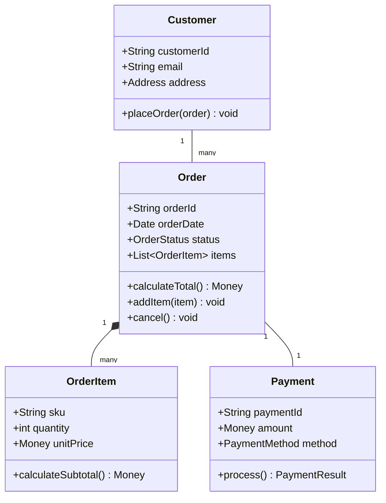
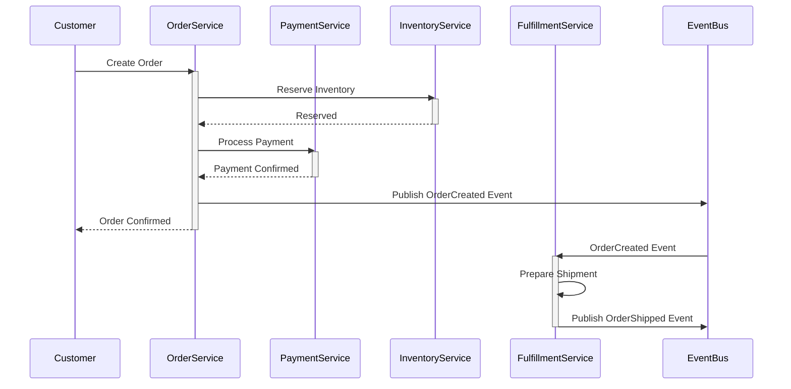
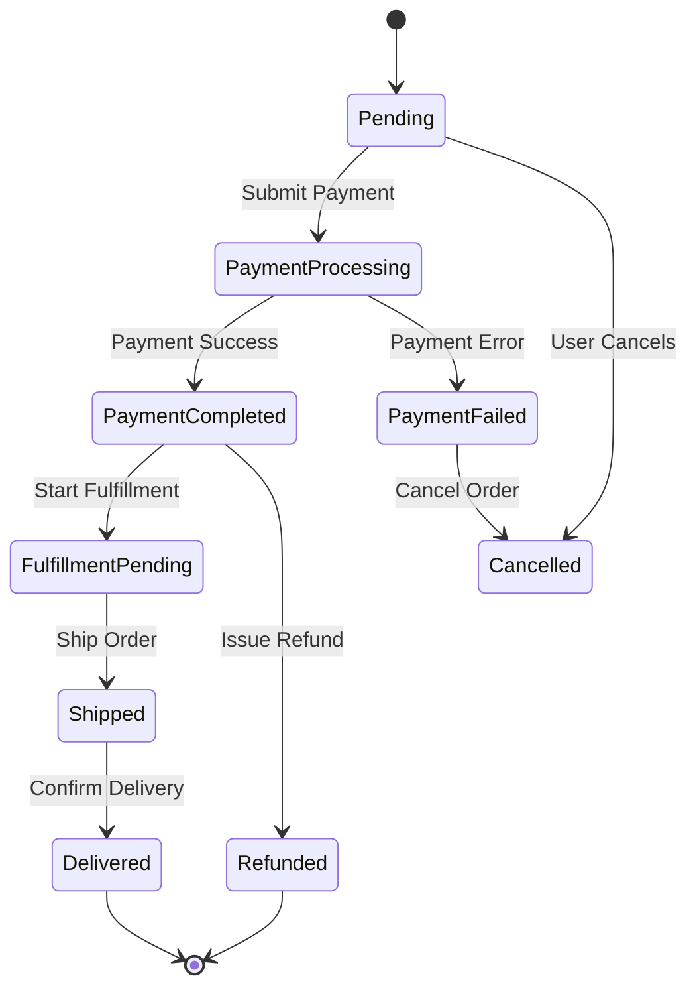
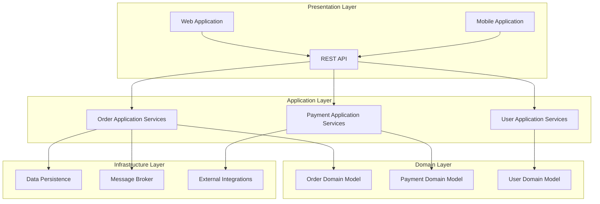
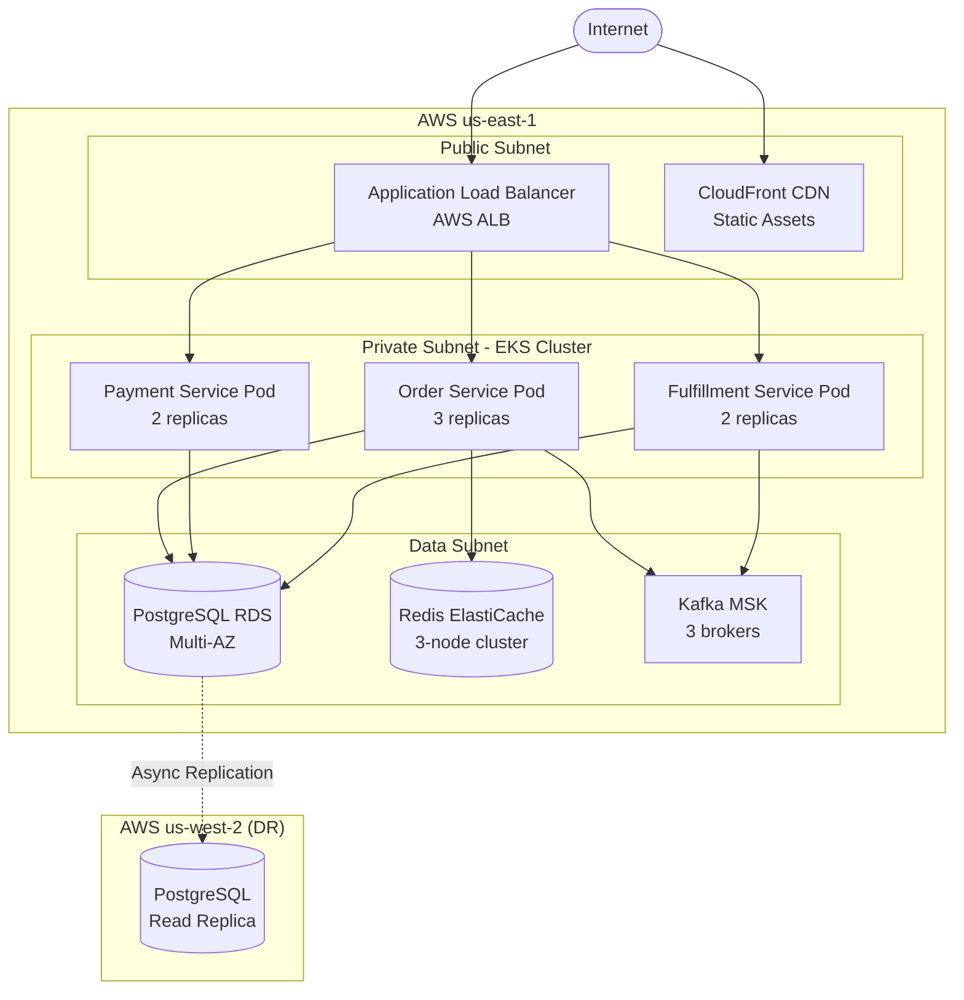

# 4+1 Architectural Views - Complete Template

The 4+1 Architectural Views model, created by Philippe Kruchten, describes software architecture through multiple concurrent views to address the concerns of different stakeholders.

---

## Overview

### The Five Views

1. **Logical View**: Functionality provided to end-users (object model, classes)
2. **Process View**: Runtime behavior (concurrency, processes, threads)
3. **Development View**: Software organization from developer perspective (modules, packages)
4. **Physical View**: Deployment to hardware (servers, networks, topology)
5. **Scenarios (+1)**: Use cases that tie all views together (integration perspective)

### When to Use

- **Complex enterprise systems** with multiple stakeholder types
- **Distributed systems** requiring clear separation of concerns
- **Systems with strong non-functional requirements** (performance, scalability, reliability)
- **Long-lived systems** that need comprehensive documentation
- **Multi-team projects** where different teams focus on different aspects

### Stakeholders per View

| View | Primary Stakeholders |
|------|---------------------|
| Logical | End users, Business analysts, System analysts |
| Process | System engineers, Performance engineers |
| Development | Developers, Software managers |
| Physical | System engineers, Operations, Infrastructure team |
| Scenarios | All stakeholders (validation perspective) |

---

## Template Structure

```markdown
# [System Name] - 4+1 Architectural Views

**Version**: [X.X]  
**Date**: [YYYY-MM-DD]  
**Authors**: [Names]  
**Status**: [Draft | Review | Approved]

---

## 1. Introduction

### 1.1 Purpose
[Why this document exists]

### 1.2 Scope
[What the architecture covers]

### 1.3 References
[Related documents, standards, frameworks]

### 1.4 Definitions
[Key terms and acronyms]

---

## 2. Architectural Drivers

### 2.1 Business Goals
[Key business objectives the architecture must support]

### 2.2 Quality Attributes
[Performance, security, scalability, etc.]

### 2.3 Constraints
[Technical, organizational, budget constraints]

### 2.4 Assumptions
[Key assumptions the architecture relies on]

---

## 3. Logical View

### 3.1 Overview
[High-level description of functional decomposition]

### 3.2 Key Abstractions
[Main domain objects, entities, concepts]

### 3.3 Class Diagrams
[UML class diagrams showing relationships]

### 3.4 Package Diagrams
[Logical organization of functionality]

### 3.5 Design Patterns
[Patterns applied: MVC, Repository, Factory, etc.]

---

## 4. Process View

### 4.1 Overview
[Runtime behavior and concurrency aspects]

### 4.2 Process Architecture
[Main processes, threads, communication]

### 4.3 Concurrency Model
[How system handles concurrent operations]

### 4.4 State Machines
[Key state transitions and lifecycle]

### 4.5 Sequence Diagrams
[Runtime interactions for key scenarios]

### 4.6 Performance Considerations
[Bottlenecks, optimization strategies]

---

## 5. Development View

### 5.1 Overview
[Software organization from developer perspective]

### 5.2 Module Structure
[Layers, modules, packages organization]

### 5.3 Component Diagrams
[Development-time components and dependencies]

### 5.4 Build Structure
[How code is organized for building]

### 5.5 Configuration Management
[Version control, branching strategy]

### 5.6 Testing Strategy
[Unit, integration, system testing approach]

---

## 6. Physical View

### 6.1 Overview
[Deployment topology and hardware mapping]

### 6.2 Deployment Diagrams
[Software to hardware mapping]

### 6.3 Network Architecture
[Network topology, protocols, security zones]

### 6.4 Infrastructure Components
[Servers, load balancers, databases, etc.]

### 6.5 Scalability Strategy
[How system scales horizontally/vertically]

### 6.6 High Availability
[Redundancy, failover, disaster recovery]

---

## 7. Scenarios (Use Case View)

### 7.1 Overview
[How scenarios validate the architecture]

### 7.2 Key Scenarios

#### Scenario 1: [Name]
- **Description**: [What happens]
- **Actors**: [Who is involved]
- **Flow**: [Step-by-step]
- **Views Involved**: [Which views this scenario touches]
- **Quality Attributes**: [What it validates]

#### Scenario 2: [Name]
[Same structure]

### 7.3 Scenario Mapping
[How scenarios map across all four views]

---

## 8. Architectural Decisions

### 8.1 Key Decisions
[Major architectural choices made]

### 8.2 Trade-offs
[What was gained, what was sacrificed]

### 8.3 Alternatives Considered
[Options evaluated and rejected]

---

## 9. Quality Attributes Analysis

### 9.1 Performance
[How architecture addresses performance]

### 9.2 Security
[Security architecture and measures]

### 9.3 Scalability
[Scaling approach and limits]

### 9.4 Reliability
[Fault tolerance, recovery]

### 9.5 Maintainability
[How easy to maintain and evolve]

---

## Appendices

### A. Glossary
[Terms and definitions]

### B. References
[External documents, standards]

### C. Revision History
[Document changes over time]
```

---

## View 1: Logical View (Functional Structure)

### Purpose
Describe the **functional requirements** the system provides to end users - the "what" the system does.

### Key Elements
- **Classes and Objects**: Core domain entities
- **Packages/Namespaces**: Logical grouping of functionality
- **Interfaces**: Contracts between components
- **Relationships**: Associations, aggregations, dependencies
- **Design Patterns**: Applied structural patterns

### Notation
- UML Class Diagrams
- UML Package Diagrams
- Component Diagrams (logical components)

### Mermaid Example



### Documentation Template

```markdown
## Logical View

### Domain Model

The system is organized around the following key abstractions:

**Order Aggregate**
- Central domain entity representing a customer purchase
- Encapsulates order items, pricing, and lifecycle
- Enforces business invariants (minimum order value, valid states)

**Customer Entity**
- Represents system users
- Manages authentication credentials and profile
- Associated with order history and preferences

**Payment Value Object**
- Immutable representation of payment transaction
- Contains payment method, amount, and status
- Validated against payment gateway responses

### Logical Packages

```
com.company.ecommerce
├── domain
│   ├── order (Order, OrderItem, OrderStatus)
│   ├── customer (Customer, Address)
│   ├── payment (Payment, PaymentMethod)
│   └── product (Product, SKU, Price)
├── application
│   ├── services (OrderService, PaymentService)
│   └── dto (Data Transfer Objects)
├── infrastructure
│   ├── persistence (Repositories)
│   └── external (Payment Gateway, Email Service)
└── api
    └── controllers (REST endpoints)
```

### Design Patterns

- **Domain-Driven Design**: Aggregate pattern for Order
- **Repository Pattern**: Data access abstraction
- **Factory Pattern**: Order creation with validation
- **Strategy Pattern**: Multiple payment methods
- **Observer Pattern**: Order status change notifications
```

---

## View 2: Process View (Dynamic Behavior)

### Purpose
Describe **runtime behavior**, including concurrency, distribution, system integrity, and fault tolerance - the "how" at runtime.

### Key Elements
- **Processes**: Independent execution units
- **Threads**: Concurrent execution within processes
- **Communication**: IPC, messaging, RPC
- **Synchronization**: Locks, semaphores, coordination
- **State Machines**: Lifecycle and state transitions

### Notation
- UML Sequence Diagrams
- UML Activity Diagrams
- State Machine Diagrams
- Timing Diagrams

### Mermaid Example



### State Machine Example



### Documentation Template

```markdown
## Process View

### Process Architecture

The system consists of the following main processes:

**Application Processes** (stateless, horizontally scalable)
- OrderService (3-10 instances)
- PaymentService (2-8 instances)
- FulfillmentService (2-6 instances)
- NotificationService (2-5 instances)

**Data Processes**
- PostgreSQL (primary + 2 read replicas)
- Redis (3-node cluster)
- Kafka (3 brokers)

### Concurrency Model

**Request Processing**
- Asynchronous, non-blocking I/O (Node.js event loop)
- Thread pool for blocking operations (size: 50)
- Connection pool to databases (max: 20 per instance)

**Event Processing**
- Kafka consumer groups for parallel processing
- Each service has dedicated consumer group
- Message processing is idempotent

### Critical Scenarios

#### Order Creation Flow
1. Customer submits order (HTTPS request)
2. OrderService validates and reserves inventory (sync)
3. PaymentService processes payment (sync, 5s timeout)
4. OrderService publishes OrderCreated event (async)
5. FulfillmentService picks up event (async)
6. NotificationService sends confirmation (async)

**Performance Requirements**:
- End-to-end: <3s for order confirmation
- Payment processing: <2s
- Event propagation: <500ms

#### Failure Scenarios

**Payment Timeout**
- Retry up to 3 times with exponential backoff
- After 3 failures, mark payment as failed
- Release reserved inventory
- Notify customer of failure

**Service Unavailability**
- Circuit breaker opens after 5 consecutive failures
- Fallback: queue requests for later processing
- Health check every 30s to close circuit
```

---

## View 3: Development View (Software Organization)

### Purpose
Describe the **static organization** of software modules from a developer's perspective - the code structure.

### Key Elements
- **Modules/Packages**: Code organization
- **Layers**: Logical separation (presentation, business, data)
- **Dependencies**: Between modules
- **Build Units**: Libraries, JARs, packages
- **Source Control**: Repository structure

### Notation
- UML Package Diagrams
- UML Component Diagrams
- Dependency Graphs
- Layer Diagrams

### Mermaid Example



### Documentation Template

```markdown
## Development View

### Module Structure

The codebase follows a **layered architecture** with clear dependency rules:

**Layer 1: Presentation** (depends on Application)
- `web-app/` - React SPA
- `mobile-app/` - React Native application
- `api-gateway/` - Kong configuration

**Layer 2: Application** (depends on Domain)
- `order-service/` - Order management
- `payment-service/` - Payment processing
- `fulfillment-service/` - Fulfillment coordination
- `notification-service/` - Notifications

**Layer 3: Domain** (no dependencies, pure business logic)
- `order-domain/` - Order aggregate, entities, value objects
- `payment-domain/` - Payment models
- `shared-kernel/` - Common domain concepts

**Layer 4: Infrastructure** (implements domain interfaces)
- `persistence/` - Database repositories
- `messaging/` - Kafka producers/consumers
- `external-clients/` - HTTP clients for external APIs

### Dependency Rules

✅ **Allowed Dependencies**:
- Presentation → Application → Domain → Infrastructure (one-way only)
- Infrastructure → Domain (implements domain interfaces)

❌ **Forbidden Dependencies**:
- Domain → Infrastructure (violates clean architecture)
- Domain → Application (domain is innermost layer)

### Build Structure

**Gradle Multi-Module Project**
```
order-service/
├── order-api (Spring Boot application)
├── order-domain (Pure Java library)
├── order-application (Application services)
├── order-infrastructure (JPA repositories, Kafka)
└── build.gradle
```

**Build Order**:
1. order-domain (no dependencies)
2. order-application (depends on domain)
3. order-infrastructure (depends on domain)
4. order-api (depends on all)

### Package Naming Convention

```
com.company.ecommerce
├── [service-name]
│   ├── domain
│   │   ├── model (entities, value objects)
│   │   ├── repository (interfaces only)
│   │   └── service (domain services)
│   ├── application
│   │   ├── command (write operations)
│   │   ├── query (read operations)
│   │   └── dto (data transfer objects)
│   ├── infrastructure
│   │   ├── persistence (JPA implementations)
│   │   ├── messaging (Kafka)
│   │   └── rest (HTTP clients)
│   └── api
│       └── rest (REST controllers)
```

### Code Organization Principles

- **High Cohesion**: Related classes in same package
- **Low Coupling**: Minimal dependencies between packages
- **Interface Segregation**: Small, focused interfaces
- **Dependency Inversion**: Depend on abstractions, not concrete classes
```

---

## View 4: Physical View (Deployment)

### Purpose
Describe the **mapping of software to hardware** - where things run and how they communicate.

### Key Elements
- **Nodes**: Physical or virtual machines
- **Artifacts**: Deployable units (JARs, containers, executables)
- **Communication Paths**: Network connections, protocols
- **Topology**: Geographic distribution, zones
- **Infrastructure**: Load balancers, firewalls, storage

### Notation
- UML Deployment Diagrams
- Network Topology Diagrams
- Infrastructure Diagrams

### Mermaid Example



### Documentation Template

```markdown
## Physical View

### Deployment Architecture

**Cloud Provider**: AWS  
**Primary Region**: us-east-1  
**DR Region**: us-west-2

### Infrastructure Components

#### Compute Layer

**EKS Cluster** (Kubernetes 1.28)
- Node Group: t3.xlarge (4 vCPU, 16GB RAM)
- Autoscaling: 6-20 nodes
- Availability Zones: us-east-1a, us-east-1b, us-east-1c

**Service Pods**
- Order Service: 3-10 pods (autoscaling on CPU >70%)
- Payment Service: 2-8 pods
- Fulfillment Service: 2-6 pods
- Notification Service: 2-5 pods

#### Data Layer

**Amazon RDS PostgreSQL**
- Instance: db.r6g.xlarge (4 vCPU, 32GB RAM)
- Multi-AZ: Primary in us-east-1a, standby in us-east-1b
- Storage: 500GB gp3 (auto-scaling to 2TB)
- Backup: Daily snapshots, 7-day retention
- Read Replica: 1 in us-west-2 for DR

**Amazon ElastiCache Redis**
- Node Type: cache.r6g.large (2 vCPU, 13GB RAM)
- Cluster Mode: 3 shards, 1 replica per shard
- High Availability: Multi-AZ automatic failover

**Amazon MSK (Kafka)**
- Broker Nodes: 3x kafka.m5.large
- Partitions: 30 (10 per broker)
- Replication Factor: 3
- Retention: 7 days

#### Network Layer

**Application Load Balancer**
- Public-facing HTTPS endpoint
- SSL/TLS termination (ACM certificate)
- Health checks: /health endpoint every 30s
- Target Groups per service

**CloudFront CDN**
- Origin: S3 bucket (static assets)
- Edge Locations: Global distribution
- Cache TTL: 1 hour (static), 5 min (API responses)

### Network Topology

**VPC Structure**
- CIDR: 10.0.0.0/16
- Public Subnets: 10.0.1.0/24, 10.0.2.0/24, 10.0.3.0/24
- Private Subnets (EKS): 10.0.11.0/24, 10.0.12.0/24, 10.0.13.0/24
- Data Subnets: 10.0.21.0/24, 10.0.22.0/24, 10.0.23.0/24

**Security Groups**
- ALB SG: Allow 443 from 0.0.0.0/0
- EKS SG: Allow from ALB SG
- RDS SG: Allow 5432 from EKS SG
- Redis SG: Allow 6379 from EKS SG
- MSK SG: Allow 9092 from EKS SG

### Scaling Strategy

**Horizontal Pod Autoscaling**
- Metric: CPU utilization
- Target: 70%
- Scale up: +50% pods when CPU >70% for 2 min
- Scale down: -25% pods when CPU <40% for 5 min
- Cooldown: 5 min between scale events

**Database Scaling**
- Vertical: Manual instance resizing during maintenance window
- Horizontal: Read replicas for read-heavy workloads
- Sharding: Future consideration for >10M orders

### High Availability

**Failure Scenarios**

| Component Failure | Impact | Recovery |
|------------------|--------|----------|
| Single pod crashes | None (multiple replicas) | Kubernetes auto-restart |
| Entire node fails | Minimal (pods reschedule) | K8s reschedules to healthy nodes |
| AZ failure | Service continues (multi-AZ) | Traffic routes to healthy AZs |
| RDS primary fails | <30s downtime | Automatic failover to standby |
| Region failure | Manual DR activation | Promote us-west-2 replica |

**RTO/RPO**
- RTO (Recovery Time Objective): 1 hour
- RPO (Recovery Point Objective): 15 minutes
```

---

## View 5: Scenarios (+1 View)

### Purpose
**Validate and illustrate** the architecture by showing how the four views work together to support key use cases.

### Key Elements
- **Use Cases**: User interactions with the system
- **Quality Attribute Scenarios**: Performance, security, availability scenarios
- **Cross-View Mapping**: How each scenario touches multiple views
- **End-to-End Flows**: Complete system behavior

### Documentation Template

```markdown
## Scenarios (Use Case View)

### Overview
Scenarios validate that the architecture supports key use cases and quality requirements. Each scenario demonstrates how multiple views collaborate.

---

### Scenario 1: Customer Places Order (Happy Path)

**Description**: Customer adds items to cart and completes checkout successfully.

**Actors**: Customer, Order Service, Payment Service, Inventory Service, Fulfillment Service

**Preconditions**:
- Customer is authenticated
- Items are in stock
- Payment method is valid

**Main Flow**:
1. Customer adds items to cart (Web App)
2. Customer initiates checkout
3. Order Service validates order
4. Inventory Service reserves stock
5. Payment Service processes payment
6. Order Service confirms order
7. Fulfillment Service receives order event
8. Notification Service sends confirmation email

**Views Involved**:

**Logical View**:
- Order aggregate validates business rules
- Payment value object encapsulates payment data
- OrderItem calculates pricing

**Process View**:
- Order Service orchestrates synchronous calls
- Event published to Kafka for async fulfillment
- Payment processed with 5s timeout

**Development View**:
- API Gateway routes request to Order Service
- Order Application Service coordinates workflow
- Domain layer enforces invariants

**Physical View**:
- Request hits ALB → Order Service pod
- Order Service queries RDS for validation
- Payment Service calls Stripe API (external)
- Kafka event queued in MSK

**Performance Requirements**:
- End-to-end: <3s for order confirmation
- Inventory check: <100ms
- Payment processing: <2s

**Quality Attributes Validated**:
- ✅ Performance (sub-3s response)
- ✅ Reliability (transaction atomicity via Saga)
- ✅ Scalability (stateless services, async processing)

---

### Scenario 2: Payment Fails (Error Path)

**Description**: Payment gateway returns error during checkout.

**Main Flow**:
1-4. Same as Scenario 1
5. Payment Service receives error from Stripe
6. Payment Service returns failure to Order Service
7. Order Service initiates compensation:
   - Releases reserved inventory
   - Marks order as "Payment Failed"
   - Publishes OrderPaymentFailed event
8. Notification Service sends payment failure email
9. Customer sees error message with retry option

**Views Involved**:

**Process View** (focus):
- Saga orchestrator triggers compensation
- Inventory Service releases reservation
- State machine transitions to PaymentFailed state

**Logical View**:
- Order aggregate enforces state transition rules
- Cannot retry payment in certain states

**Physical View**:
- No persistent state for failed order (removed from DB)
- Event logged in Kafka for audit

**Quality Attributes Validated**:
- ✅ Reliability (proper error handling)
- ✅ Data Integrity (compensation ensures consistency)
- ✅ User Experience (clear error message, retry option)

---

### Scenario 3: High Traffic Spike (Performance Scenario)

**Description**: Black Friday sale causes 10x normal traffic.

**Stimulus**: Traffic increases from 10K orders/hour to 100K orders/hour

**Response Measures**:
- Maintain p95 latency <5s
- Zero order loss
- No service crashes

**Architecture Response**:

**Physical View** (focus):
- Horizontal Pod Autoscaler scales Order Service from 3 to 15 pods
- EKS cluster adds 8 nodes
- Redis cache hit rate increases to 95%
- Kafka partitions distribute load across 3 brokers

**Process View**:
- Queue depth in Kafka increases but stays manageable
- Fulfillment Service processes events at slower rate (acceptable)
- Circuit breaker prevents cascading failures

**Logical View**:
- No changes (stateless design supports scaling)

**Quality Attributes Validated**:
- ✅ Scalability (handles 10x traffic)
- ✅ Performance (latency within SLA)
- ✅ Resilience (no failures despite load)

---

### Scenario 4: Database Primary Fails (Availability Scenario)

**Description**: Primary RDS instance fails unexpectedly.

**Stimulus**: Hardware failure in us-east-1a

**Response Measures**:
- RTO: <1 minute
- RPO: 0 (no data loss)

**Architecture Response**:

**Physical View** (focus):
- RDS automatic failover to standby in us-east-1b
- DNS update to point to new primary
- Connection pools reconnect automatically

**Process View**:
- Services experience brief connection errors
- Retry logic succeeds after failover completes
- In-flight transactions rolled back and retried

**Development View**:
- No code changes needed (infrastructure handles failover)

**Measured Results**:
- Actual downtime: 28 seconds
- 3 orders failed and retried automatically
- No data loss

**Quality Attributes Validated**:
- ✅ Availability (exceeds 99.95% target)
- ✅ Reliability (automatic recovery)
- ✅ Data Integrity (zero data loss)

---

### Scenario Mapping Matrix

| Scenario | Logical | Process | Development | Physical | Quality Attributes |
|----------|---------|---------|-------------|----------|-------------------|
| Place Order | ★★★ | ★★★ | ★★ | ★★ | Performance, Reliability |
| Payment Fails | ★★ | ★★★ | ★ | ★ | Reliability, Data Integrity |
| High Traffic | ★ | ★★ | ★ | ★★★ | Scalability, Performance |
| DB Failover | - | ★★ | - | ★★★ | Availability, Reliability |
| Security Audit | ★ | ★ | ★★ | ★★★ | Security, Compliance |

★★★ = Primary focus, ★★ = Secondary, ★ = Minor, - = Not involved
```

---

## Best Practices for 4+1 Documentation

### DO

✅ **Tailor to audience**: Different stakeholders need different views  
✅ **Use scenarios to validate**: Every architecture decision should support a scenario  
✅ **Maintain consistency**: Same element should appear consistently across views  
✅ **Start with scenarios**: Understand use cases before designing views  
✅ **Update all views**: When architecture changes, update all affected views  
✅ **Cross-reference**: Link related elements across views

### DON'T

❌ **Don't duplicate information**: Each view should add unique perspective  
❌ **Don't skip scenarios**: Without scenarios, views are just disconnected diagrams  
❌ **Don't over-detail**: Focus on architecturally significant elements  
❌ **Don't ignore tradeoffs**: Document decisions and alternatives  
❌ **Don't create views in isolation**: Views must be coherent with each other

---

## Mapping 4+1 to Other Frameworks

### 4+1 Views vs C4 Model

| 4+1 View | C4 Model Equivalent |
|----------|-------------------|
| Logical View | Component Diagram (internal structure) |
| Process View | Dynamic diagrams (sequence, state) |
| Development View | Component Diagram (development-time) |
| Physical View | Deployment Diagram (with infrastructure) |
| Scenarios | Use Cases (driving the model) |

**When to use each**:
- **C4**: Modern, agile, lightweight documentation
- **4+1**: Comprehensive, formal, enterprise systems

### 4+1 Views vs Arc42

| 4+1 View | Arc42 Sections |
|----------|---------------|
| Logical View | Section 5 (Building Blocks) |
| Process View | Section 6 (Runtime View) |
| Development View | Section 8 (Concepts) |
| Physical View | Section 7 (Deployment View) |
| Scenarios | Section 10 (Quality Requirements) |

---

## References

- Kruchten, Philippe (1995). "Architectural Blueprints—The 4+1 View Model of Software Architecture"
- [IEEE 1471-2000 Standard](https://en.wikipedia.org/wiki/ISO/IEC_42010)
- Software Architecture in Practice (Bass, Clements, Kazman)
- [C4 Model](https://c4model.com) for comparison