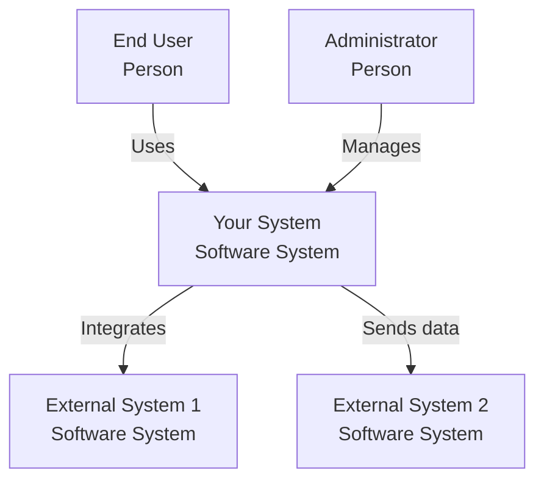
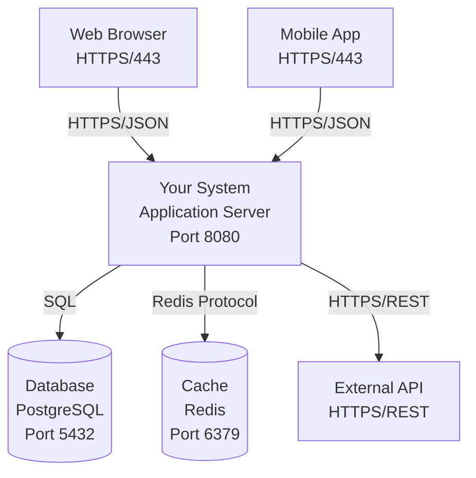
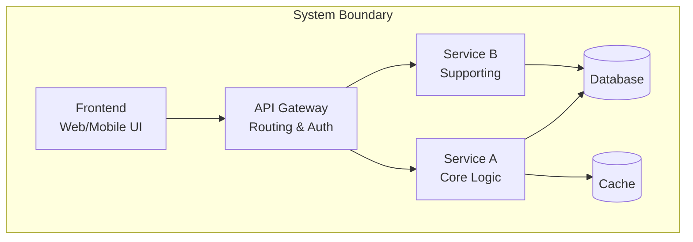
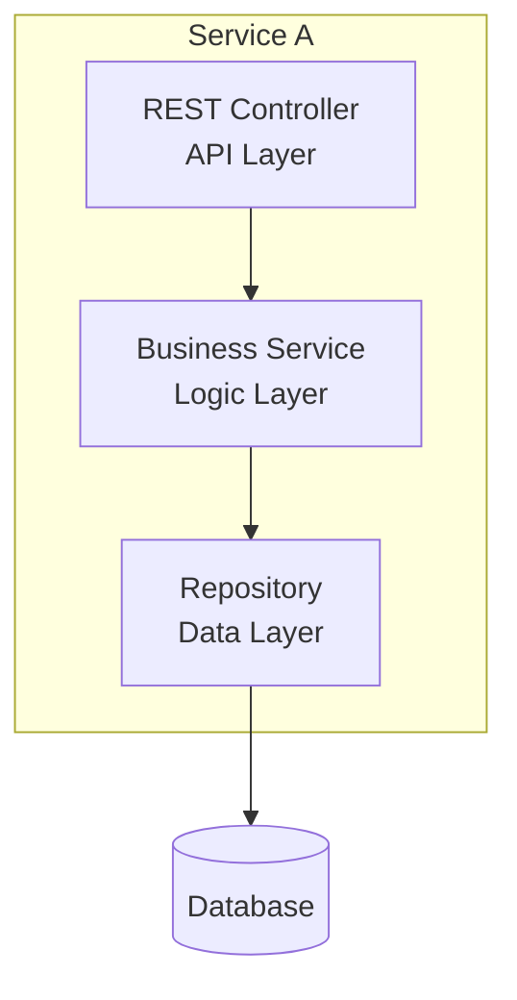
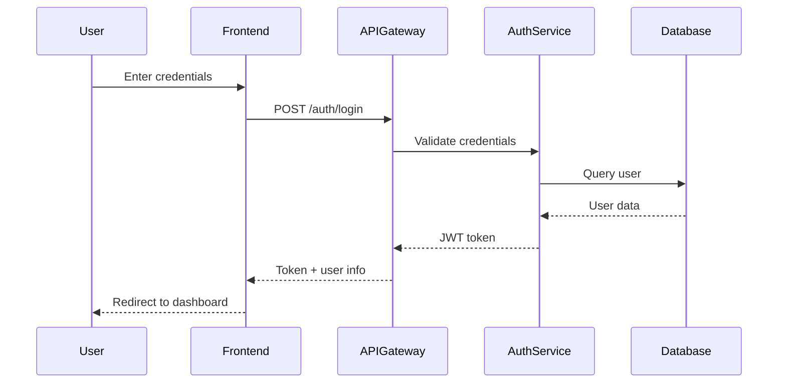
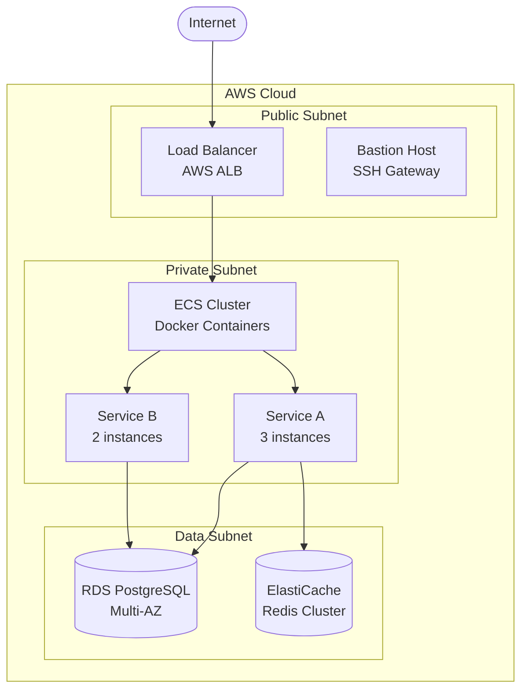
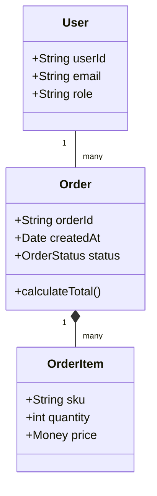

# Arc42 Architecture Documentation Template

Arc42 is a comprehensive template for software architecture documentation and communication. It provides 12 sections covering all aspects of architecture documentation.

**Created by**: Dr. Gernot Starke and Dr. Peter Hruschka  
**License**: Creative Commons (CC BY-SA 4.0)  
**Official Site**: https://arc42.org

---

## When to Use Arc42

### Ideal For:
- **Complete system documentation** requiring comprehensive coverage
- **Long-lived systems** that need thorough reference documentation
- **Complex enterprise applications** with multiple stakeholders
- **Regulatory environments** requiring detailed documentation
- **Team onboarding** where new members need complete system understanding
- **Systems with significant technical debt** requiring full assessment

### Not Ideal For:
- Quick POCs or prototypes (too heavyweight)
- Agile teams preferring lightweight documentation (consider C4)
- Systems with rapidly changing requirements (maintenance overhead)

---

## Arc42 Structure Overview

Arc42 organizes documentation into **12 sections**, each addressing specific architectural concerns:

| Section | Name | Purpose | Key Stakeholders |
|---------|------|---------|------------------|
| 1 | Introduction and Goals | Why the system exists | Business, Management |
| 2 | Constraints | Limitations and boundaries | All |
| 3 | Context and Scope | System boundaries | Business, Architects |
| 4 | Solution Strategy | Key decisions summary | Architects, Developers |
| 5 | Building Block View | Static structure | Developers, Architects |
| 6 | Runtime View | Dynamic behavior | Developers, Operations |
| 7 | Deployment View | Infrastructure mapping | Operations, Architects |
| 8 | Crosscutting Concepts | System-wide concepts | Developers, Architects |
| 9 | Architecture Decisions | ADRs and rationale | All |
| 10 | Quality Requirements | Non-functional requirements | All |
| 11 | Risks and Technical Debt | Known issues | Management, Architects |
| 12 | Glossary | Terms and definitions | All |

---

## Complete Template

```markdown
# [System Name] Architecture Documentation

**Version**: [X.X]  
**Date**: [YYYY-MM-DD]  
**Status**: [Draft | Review | Approved]  
**Authors**: [Names and Roles]  
**Template Version**: Arc42 8.0

---

## About This Document

### Purpose
[Why this documentation exists and who should read it]

### How to Read This Document
[Guide for different stakeholders - which sections matter to whom]

### Document Conventions
[Notation, diagramming standards, terminology conventions]

---

# 1. Introduction and Goals

## 1.1 Requirements Overview

### Business Context
[High-level business problem being solved]

### Key Features
- [Feature 1]: [Brief description]
- [Feature 2]: [Brief description]
- [Feature 3]: [Brief description]

### Key Requirements
[3-5 most important functional requirements]

## 1.2 Quality Goals

The top 3-5 quality goals for the architecture, **prioritized**:

| Priority | Quality Goal | Motivation |
|----------|-------------|------------|
| 1 | [e.g., Performance] | [Why this is most critical] |
| 2 | [e.g., Security] | [Why this matters] |
| 3 | [e.g., Maintainability] | [Justification] |

## 1.3 Stakeholders

| Role/Name | Expectations | Contact |
|-----------|-------------|---------|
| Product Owner | [What they need from architecture] | [Contact info] |
| Development Team | [Their concerns] | [Contact info] |
| Operations Team | [Their requirements] | [Contact info] |
| End Users | [Their needs] | [Contact info] |
| Compliance Officer | [Regulatory concerns] | [Contact info] |

---

# 2. Constraints

## 2.1 Technical Constraints

| Constraint | Background | Impact |
|------------|-----------|--------|
| [e.g., Must use Java] | [Company standard] | [Limited language options] |
| [e.g., AWS only] | [Existing contract] | [Cannot use other clouds] |
| [e.g., Oracle DB] | [Legacy systems] | [No NoSQL options] |

## 2.2 Organizational Constraints

| Constraint | Background | Impact |
|------------|-----------|--------|
| [e.g., Team size: 5 developers] | [Budget limitation] | [Cannot build complex system] |
| [e.g., 6-month timeline] | [Market pressure] | [Must use proven technologies] |
| [e.g., Offshore team] | [Cost optimization] | [Need clear documentation] |

## 2.3 Conventions

**Coding Standards**: [Link to coding guidelines]  
**Documentation Standards**: [Templates and formats]  
**Architecture Principles**: [Key principles to follow]  
**Naming Conventions**: [How to name things]

---

# 3. Context and Scope

## 3.1 Business Context

### System Context Diagram



### Business Context Description

**[Your System]**
- Purpose: [What problem it solves]
- Scope: [What's included, what's excluded]
- Key capabilities: [Main features]

**External Systems and Interfaces**

| System/Interface | Description | Protocol | Data Exchanged |
|-----------------|-------------|----------|----------------|
| [External System 1] | [Purpose] | [HTTPS/REST] | [Customer data] |
| [External System 2] | [Purpose] | [SOAP] | [Order information] |

## 3.2 Technical Context

### Technical Context Diagram



### Technical Interfaces

**Input Interfaces**

| Interface | Technology | Data Format | Purpose |
|-----------|-----------|-------------|---------|
| [REST API] | [HTTPS] | [JSON] | [Customer requests] |
| [Message Queue] | [Kafka] | [Avro] | [Event processing] |

**Output Interfaces**

| Interface | Technology | Data Format | Purpose |
|-----------|-----------|-------------|---------|
| [Database] | [PostgreSQL] | [SQL] | [Data persistence] |
| [External API] | [HTTPS/REST] | [JSON] | [Third-party integration] |

---

# 4. Solution Strategy

## 4.1 Technology Decisions

| Decision | Rationale | Alternatives Considered |
|----------|-----------|------------------------|
| [Microservices] | [Scalability, team autonomy] | [Monolith (rejected - not scalable)] |
| [PostgreSQL] | [ACID, mature, team expertise] | [MongoDB (rejected - need strong consistency)] |
| [React] | [Component reusability, ecosystem] | [Angular (rejected - steeper learning curve)] |

## 4.2 Top-Level Decomposition

[Brief description of how system is broken down]

**Main Components**:
- [Component 1]: [Responsibility]
- [Component 2]: [Responsibility]
- [Component 3]: [Responsibility]

## 4.3 Quality Goals Achievement

| Quality Goal | Approach | Key Patterns/Technologies |
|--------------|----------|--------------------------|
| [Performance] | [Caching, async processing] | [Redis, Kafka] |
| [Security] | [Defense in depth] | [OAuth 2.0, TLS, encryption at rest] |
| [Scalability] | [Horizontal scaling] | [Kubernetes, stateless services] |

## 4.4 Organizational Strategy

**Team Structure**: [How teams are organized around architecture]  
**Development Process**: [Agile, DevOps, CI/CD approach]  
**Communication**: [How teams coordinate]

---

# 5. Building Block View

## 5.1 Whitebox: Overall System

### Overview
[Description of the system's main building blocks]

### Building Block Diagram



### Building Block Descriptions

#### Frontend
- **Purpose**: User interface for web and mobile
- **Responsibilities**: 
  - Render UI
  - Handle user interactions
  - Client-side validation
- **Interfaces**: REST API calls to API Gateway
- **Quality Attributes**: Responsive, accessible, fast load times

#### API Gateway
- **Purpose**: Single entry point for all client requests
- **Responsibilities**:
  - Request routing
  - Authentication and authorization
  - Rate limiting
  - Request/response transformation
- **Interfaces**: 
  - Input: HTTPS from clients
  - Output: Internal service calls
- **Quality Attributes**: High availability, low latency

#### Service A
- **Purpose**: [Core business logic]
- **Responsibilities**: [List key responsibilities]
- **Interfaces**: [APIs exposed, dependencies]
- **Quality Attributes**: [Performance targets, etc.]

## 5.2 Blackbox: [Service A] (Level 2)

[For important components, drill down one level]

### Internal Structure



### Component Descriptions

#### REST Controller
- **Purpose**: Handle HTTP requests
- **Responsibilities**: Request validation, DTO conversion, error handling
- **Interfaces**: REST endpoints documented in OpenAPI spec

#### Business Service
- **Purpose**: Business logic execution
- **Responsibilities**: Domain rules, orchestration, transaction management
- **Interfaces**: Service interfaces (internal)

#### Repository
- **Purpose**: Data access abstraction
- **Responsibilities**: CRUD operations, query optimization, caching
- **Interfaces**: Repository interfaces following Repository pattern

---

# 6. Runtime View

## 6.1 Scenario 1: [Primary Use Case - e.g., User Login]

### Overview
[Brief description of what happens]

### Sequence Diagram



### Flow Description

1. **User enters credentials**: Username and password in login form
2. **Frontend validates**: Basic client-side validation
3. **API Gateway receives**: Routes to Auth Service after rate limit check
4. **Auth Service validates**: Checks credentials against database
5. **JWT issued**: Signed JWT with user claims
6. **Session established**: Frontend stores token, redirects user

### Quality Characteristics
- **Performance**: Complete flow in <500ms (p95)
- **Security**: Password hashed with bcrypt, JWT signed with RS256
- **Resilience**: Retry on network failure, cache user data in Redis

## 6.2 Scenario 2: [Error Scenario - e.g., Service Failure]

[Similar structure for error/failure scenarios]

## 6.3 Scenario 3: [Complex Workflow - e.g., Order Processing]

[Multi-service interactions, async processing, etc.]

---

# 7. Deployment View

## 7.1 Infrastructure Overview

### Deployment Diagram



## 7.2 Infrastructure Components

### Compute Resources

**ECS Cluster**
- Instance Type: t3.large (2 vCPU, 8GB RAM)
- Auto-scaling: 3-10 instances
- Health checks: Every 30 seconds

**Container Configuration**
- Image: Docker containers from ECR
- CPU: 1 vCPU per container
- Memory: 2GB per container
- Environment variables: Injected from AWS Secrets Manager

### Data Storage

**RDS PostgreSQL**
- Version: PostgreSQL 15
- Instance: db.r6g.large (2 vCPU, 16GB RAM)
- Storage: 100GB gp3 with auto-scaling
- Multi-AZ: Automatic failover
- Backup: Daily snapshots, 7-day retention
- Encryption: At rest (AWS KMS), in transit (TLS)

**ElastiCache Redis**
- Version: Redis 7
- Node Type: cache.t3.medium
- Cluster: 3 nodes with replication
- Eviction: allkeys-lru
- Persistence: AOF enabled

### Networking

**VPC Configuration**
- CIDR: 10.0.0.0/16
- Availability Zones: 3 (us-east-1a, 1b, 1c)
- Subnets: Public, Private, Data per AZ

**Security Groups**
- ALB SG: Inbound 443 from 0.0.0.0/0
- App SG: Inbound from ALB SG only
- RDS SG: Inbound 5432 from App SG only
- Redis SG: Inbound 6379 from App SG only

## 7.3 Deployment Strategy

**Blue-Green Deployment**
- New version deployed to "green" environment
- Health checks validate green environment
- Traffic switched from blue to green
- Blue kept running for rollback (15 minutes)

**Rollback Procedure**
1. Detect issue (automated monitoring or manual)
2. Switch traffic back to blue environment
3. Investigate issue in green
4. Fix and re-deploy

---

# 8. Crosscutting Concepts

## 8.1 Domain Model

[Core domain entities and their relationships]



## 8.2 Security Concepts

**Authentication**
- Mechanism: OAuth 2.0 + JWT
- Token lifetime: 1 hour (access), 7 days (refresh)
- Storage: HttpOnly cookies for web, secure storage for mobile

**Authorization**
- Mechanism: Role-Based Access Control (RBAC)
- Roles: Admin, User, Guest
- Enforcement: API Gateway + service level

**Data Protection**
- Encryption at rest: AES-256 (AWS KMS)
- Encryption in transit: TLS 1.3
- PII handling: Tokenization for sensitive data
- Audit logging: All data access logged

## 8.3 Error Handling

**Error Categories**
- Validation errors (4xx): Return to client with details
- Business logic errors (4xx): Domain-specific error messages
- Technical errors (5xx): Log, alert, return generic message

**Error Response Format**
```json
{
  "error": {
    "code": "VALIDATION_ERROR",
    "message": "Invalid input data",
    "details": [
      {"field": "email", "message": "Invalid email format"}
    ],
    "timestamp": "2024-10-30T10:30:00Z",
    "requestId": "abc-123"
  }
}
```

## 8.4 Logging and Monitoring

**Logging Strategy**
- Format: Structured JSON logs
- Levels: ERROR, WARN, INFO, DEBUG
- Correlation ID: Traced across all services
- Storage: CloudWatch Logs with 30-day retention

**Monitoring Stack**
- APM: Datadog
- Metrics: CloudWatch + Prometheus
- Alerting: PagerDuty for critical issues
- Dashboards: Grafana for operations team

**Key Metrics**
- Request rate, error rate, latency (p50, p95, p99)
- Service health, resource utilization
- Business metrics (orders/hour, revenue)

## 8.5 Transaction Management

**Distributed Transactions**
- Pattern: Saga (orchestration)
- Compensation: Each step has compensating action
- Timeout: 30 seconds for complete saga
- Idempotency: All operations idempotent with idempotency keys

## 8.6 Caching Strategy

**Cache Levels**
- Browser cache: Static assets (TTL: 1 year)
- CDN cache: API responses (TTL: 5 minutes)
- Application cache: Redis (TTL: varies by data type)
- Database cache: Query result cache

**Cache Invalidation**
- Time-based: TTL expiration
- Event-based: Invalidate on data change events
- Manual: Admin interface for cache clearing

---

# 9. Architecture Decisions

## 9.1 Important Decisions

### ADR-001: Microservices Architecture

**Status**: Accepted  
**Date**: 2024-01-15  
**Context**: Need for independent scaling and deployment  
**Decision**: Adopt microservices architecture  
**Consequences**: 
- ✅ Independent scaling per service
- ✅ Team autonomy
- ❌ Increased operational complexity
- ❌ Network latency between services

[Link to full ADR document]

### ADR-002: PostgreSQL as Primary Database

**Status**: Accepted  
**Date**: 2024-02-01  
**Context**: Need for ACID transactions and relational data  
**Decision**: Use PostgreSQL for all structured data  
**Consequences**:
- ✅ Strong consistency guarantees
- ✅ Rich querying capabilities
- ❌ Vertical scaling limitations
- ❌ No automatic sharding

[Link to full ADR document]

### ADR-003: Event-Driven Communication

**Status**: Proposed  
**Date**: 2024-10-15  
**Context**: Need for loose coupling between services  
**Decision**: Use Kafka for asynchronous communication  
**Consequences**: [To be evaluated]

## 9.2 Decision Log

| ID | Date | Title | Status |
|----|------|-------|--------|
| ADR-001 | 2024-01-15 | Microservices Architecture | Accepted |
| ADR-002 | 2024-02-01 | PostgreSQL as Primary DB | Accepted |
| ADR-003 | 2024-10-15 | Event-Driven Communication | Proposed |
| ADR-004 | 2024-09-20 | OAuth 2.0 for Authentication | Accepted |

[Link to ADR repository]

---

# 10. Quality Requirements

## 10.1 Quality Tree

```
Quality
├── Performance
│   ├── Response Time (p95 < 200ms)
│   ├── Throughput (10K requests/sec)
│   └── Resource Efficiency (CPU < 70%)
├── Security
│   ├── Authentication (OAuth 2.0)
│   ├── Authorization (RBAC)
│   ├── Data Protection (Encryption)
│   └── Audit Trail (Complete logging)
├── Reliability
│   ├── Availability (99.95%)
│   ├── Fault Tolerance (Graceful degradation)
│   └── Recoverability (RTO < 1 hour)
├── Maintainability
│   ├── Modularity (Loose coupling)
│   ├── Testability (>80% coverage)
│   └── Documentation (Up-to-date)
└── Scalability
    ├── Horizontal Scaling (Stateless services)
    └── Load Distribution (Auto-scaling)
```

## 10.2 Quality Scenarios

### Performance Scenario

**Scenario**: Normal Load  
**Stimulus**: 5,000 concurrent users placing orders  
**Response**: System processes all requests  
**Measure**: p95 response time < 200ms

**Architecture Support**:
- Caching layer reduces database load
- Horizontal scaling handles increased traffic
- Async processing for non-critical operations

### Security Scenario

**Scenario**: Attempted Unauthorized Access  
**Stimulus**: Attacker attempts to access protected resource  
**Response**: Access denied, incident logged  
**Measure**: Zero unauthorized access, detection within 1 second

**Architecture Support**:
- JWT validation at API Gateway
- Role-based access control
- Audit logging of all access attempts

### Availability Scenario

**Scenario**: Database Primary Failure  
**Stimulus**: Hardware failure of primary database  
**Response**: Automatic failover to standby  
**Measure**: < 30 seconds downtime

**Architecture Support**:
- Multi-AZ RDS deployment
- Automatic failover configuration
- Application retry logic

## 10.3 Quality Attribute Priorities

| Priority | Quality Attribute | Target | Current | Status |
|----------|------------------|--------|---------|--------|
| 1 | Security | Zero breaches | Zero breaches | ✅ Met |
| 2 | Performance | p95 < 200ms | p95 = 180ms | ✅ Met |
| 3 | Availability | 99.95% | 99.97% | ✅ Exceeded |
| 4 | Maintainability | <2 days for changes | 1.5 days avg | ✅ Met |
| 5 | Scalability | 10K req/s | 8K req/s tested | ⚠️ Needs validation |

---

# 11. Risks and Technical Debt

## 11.1 Risks

### Risk 1: Third-Party API Dependency

**Description**: Payment gateway API is single point of failure  
**Probability**: Medium  
**Impact**: High (orders cannot complete)  
**Mitigation**: 
- Circuit breaker pattern implemented
- Fallback to manual payment processing
- Multiple payment provider integration (planned Q2)

**Status**: Active, monitoring

### Risk 2: Database Scaling Limitations

**Description**: PostgreSQL vertical scaling approaching limits  
**Probability**: High (within 12 months)  
**Impact**: Medium (performance degradation)  
**Mitigation**:
- Read replicas deployed
- Caching aggressively implemented
- Sharding strategy under evaluation

**Status**: Active, mitigation in progress

### Risk 3: Team Knowledge Concentration

**Description**: Only 2 developers understand payment integration  
**Probability**: Medium  
**Impact**: High (critical knowledge loss risk)  
**Mitigation**:
- Documentation being created
- Knowledge sharing sessions scheduled
- Cross-training program initiated

**Status**: Active, mitigation started

## 11.2 Technical Debt

### Debt Item 1: Legacy API Compatibility Layer

**Description**: Supporting deprecated v1 API alongside v2  
**Impact**: Maintenance burden, code complexity  
**Cost**: ~10% of development time  
**Plan**: Deprecate v1 by end of Q4 2024  
**Status**: On track

### Debt Item 2: Missing Integration Tests

**Description**: Only 40% coverage for integration tests  
**Impact**: Risk of regression bugs  
**Cost**: Increased QA time, production bugs  
**Plan**: Increase to 70% by Q1 2025  
**Status**: In progress

### Debt Item 3: Inconsistent Error Handling

**Description**: Different services handle errors differently  
**Impact**: Poor user experience, hard to debug  
**Cost**: Support tickets, debugging time  
**Plan**: Standardize error handling across services (Q4 2024)  
**Status**: Design phase

## 11.3 Risk Matrix

| Risk | Probability | Impact | Priority | Status |
|------|------------|--------|----------|--------|
| Third-party API dependency | Medium | High | P1 | Active |
| Database scaling | High | Medium | P1 | Mitigating |
| Knowledge concentration | Medium | High | P2 | Mitigating |
| Security vulnerability | Low | High | P2 | Monitoring |

---

# 12. Glossary

| Term | Definition |
|------|------------|
| **ADR** | Architecture Decision Record - documents significant architecture decisions |
| **API Gateway** | Single entry point for all client requests, handles routing and cross-cutting concerns |
| **CQRS** | Command Query Responsibility Segregation - pattern separating read and write operations |
| **Idempotency** | Property where operation can be applied multiple times without changing result |
| **JWT** | JSON Web Token - token format for authentication |
| **Multi-AZ** | Multi-Availability Zone - AWS deployment across multiple data centers |
| **RBAC** | Role-Based Access Control - authorization model based on user roles |
| **RTO** | Recovery Time Objective - maximum acceptable downtime |
| **RPO** | Recovery Point Objective - maximum acceptable data loss |
| **Saga** | Pattern for managing distributed transactions across microservices |
| **TTL** | Time To Live - duration data remains valid in cache |

---

# Appendices

## A. References

- [ADR Repository](link)
- [API Documentation](link)
- [DevOps Runbooks](link)
- [Security Policies](link)
- [Company Architecture Principles](link)

## B. Tools and Conventions

**Diagramming**: Mermaid syntax for all diagrams  
**Documentation**: Markdown format in Git repository  
**Code Repository**: GitHub organization/repo  
**CI/CD**: GitHub Actions  
**Monitoring**: Datadog dashboard links

## C. Revision History

| Version | Date | Author | Changes |
|---------|------|--------|---------|
| 0.1 | 2024-01-10 | J. Smith | Initial draft |
| 1.0 | 2024-03-15 | Architecture Team | First complete version |
| 1.5 | 2024-07-20 | J. Smith | Added deployment details |
| 2.0 | 2024-10-25 | Architecture Team | Major revision with Arc42 template |

---

**Document Maintenance**: This document is reviewed quarterly and updated as architecture evolves. All stakeholders are notified of significant changes.
```

---

## Arc42 Best Practices

### DO

✅ **Fill all 12 sections** - even if briefly, address each concern  
✅ **Tailor depth to audience** - more detail where it matters most  
✅ **Keep it current** - update when architecture changes  
✅ **Link to external docs** - don't duplicate, reference  
✅ **Use diagrams extensively** - visual communication is powerful  
✅ **Document decisions** - ADRs are crucial for understanding "why"

### DON'T

❌ **Don't copy-paste template blindly** - adapt to your context  
❌ **Don't over-document** - focus on architecturally significant elements  
❌ **Don't skip quality requirements** - they drive architecture  
❌ **Don't ignore technical debt** - transparency is valuable  
❌ **Don't forget glossary** - domain terms need definition  
❌ **Don't make it static** - living documentation evolves with system

---

## Mapping Arc42 to Other Frameworks

### Arc42 vs C4 Model

| Arc42 Section | C4 Model Equivalent |
|--------------|-------------------|
| Section 3 (Context) | System Context Diagram |
| Section 5 (Building Blocks) | Container + Component Diagrams |
| Section 6 (Runtime) | Dynamic Diagrams (Sequence) |
| Section 7 (Deployment) | Deployment Diagram |
| Section 9 (Decisions) | ADRs referenced in documentation |

**Key Difference**: Arc42 is comprehensive (12 sections), C4 is focused (4 levels of zoom)

### Arc42 vs 4+1 Views

| Arc42 Section | 4+1 View |
|--------------|----------|
| Section 5 (Building Blocks) | Logical View |
| Section 6 (Runtime) | Process View |
| Section 5 (alternative view) | Development View |
| Section 7 (Deployment) | Physical View |
| Section 10 (Quality) + scenarios | Scenarios (+1) |

**Key Difference**: 4+1 organized by views, Arc42 organized by concerns

---

## When to Use Which Template

### Use Arc42 When:
- Comprehensive documentation is required (regulatory, complex systems)
- Multiple stakeholder types need different perspectives
- System is long-lived and needs reference documentation
- You want a structured checklist of what to document

### Use C4 When:
- Agile, lightweight documentation is preferred
- Focus is on communicating structure at different zoom levels
- System is modern, cloud-native, microservices
- Visual communication is primary goal

### Use 4+1 When:
- Different stakeholder views are clearly separated
- Runtime behavior is complex (Process View is critical)
- System has strong separation between development and deployment concerns
- Academic or formal setting requires recognized framework

---

## Arc42 Customization Tips

### For Microservices:
- Section 5: One building block view per service
- Section 6: Focus on inter-service communication
- Section 9: Document per-service and cross-service decisions

### For Monoliths:
- Section 5: Detailed internal module structure
- Section 6: Focus on internal process flows
- Section 8: Emphasize crosscutting concerns (they're harder in monoliths)

### For Cloud-Native:
- Section 7: Detailed Kubernetes/cloud infrastructure
- Section 10: Focus on cloud-specific quality attributes (elasticity, cost)
- Section 11: Cloud lock-in as a risk

---

## References

- [Arc42 Official Website](https://arc42.org)
- [Arc42 Template Download](https://arc42.org/download)
- Starke, Gernot. "Effective Software Architecture Documentation"
- [Arc42 GitHub Repository](https://github.com/arc42)