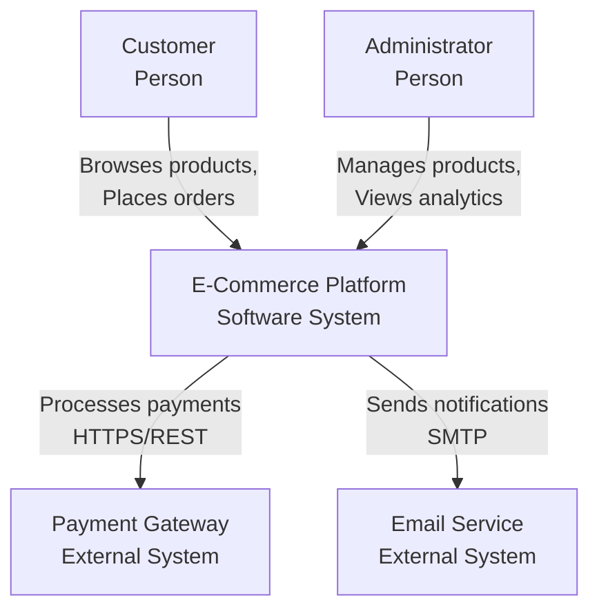
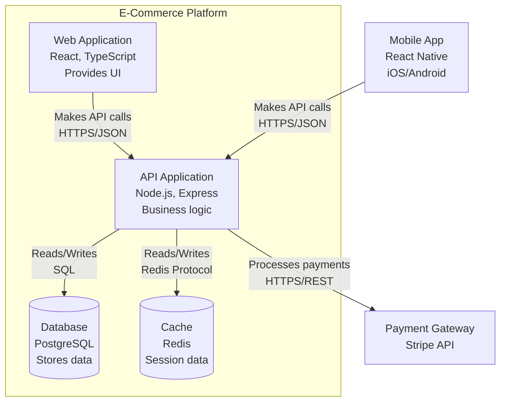
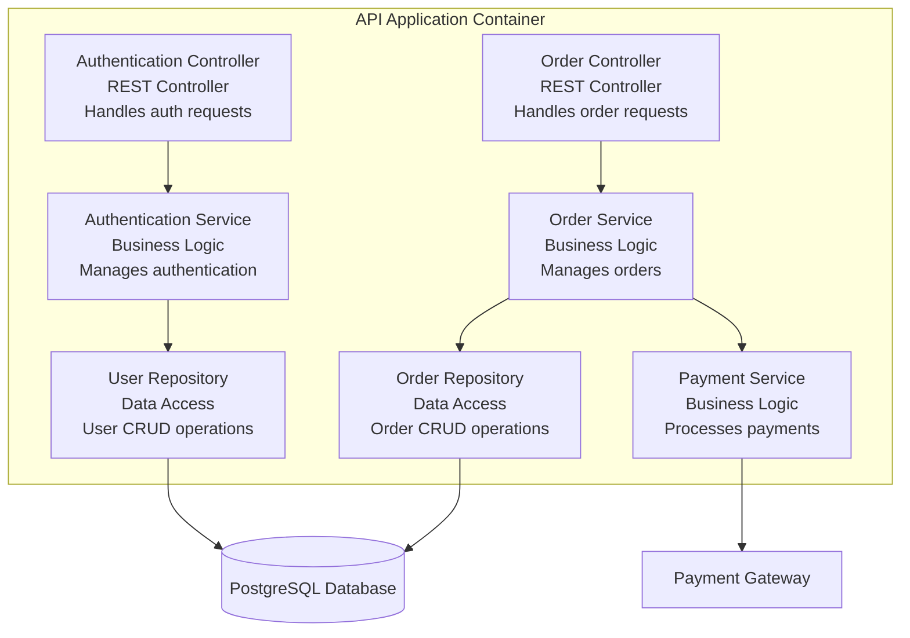

# C4 Model - Complete Guide for Documentation Generation

The C4 Model (Context, Containers, Components, Code) is a lean approach to documenting software architecture through hierarchical diagrams.

## Core Principles

1. **Abstraction-first**: Start zoomed out, progressively zoom in
2. **Audience-aware**: Different stakeholders need different levels
3. **Simple notation**: Boxes, lines, and labels - that's it
4. **Tool-agnostic**: Can be drawn with any tool
5. **Evolutionary**: Diagrams evolve with the system

---

## Level 1: System Context Diagram

### Purpose
Show the big picture - your system in its environment.

### Elements
- **Your System**: The software system you're documenting (single box)
- **People**: Users and personas who interact with the system
- **External Systems**: Other software systems that interact with yours

### When to Use
- Explaining system to new stakeholders
- Defining system boundaries
- Identifying integration points
- Early design phase

### Template Structure

```
[Person/System A] --uses/sends data to--> [Your System]
[Your System] --uses/reads from--> [External System B]
```

### Example Description Format

```markdown
## System Context

**[System Name]** is a [brief description of purpose].

### Users
- **[User Type 1]**: [Role and how they use the system]
- **[User Type 2]**: [Role and how they use the system]

### External Systems
- **[External System 1]**: [Purpose of integration, protocol/technology]
- **[External System 2]**: [Purpose of integration, protocol/technology]

### Key Relationships
- [User] uses [System] to [purpose]
- [System] integrates with [External System] via [protocol] to [purpose]
```

### Mermaid Syntax Example



---

## Level 2: Container Diagram

### Purpose
Show the high-level shape of software architecture and technology choices.

### Elements
- **Containers**: Separately deployable/runnable units (web apps, mobile apps, databases, file systems)
- Each container should have: Name, Technology, Responsibilities

### When to Use
- Explaining overall architecture to developers
- Showing technology stack
- Planning deployment
- Defining container boundaries

### What is a Container?
A container is something that needs to be running for the system to work:
- Web Application (React, Angular app)
- API Application (Spring Boot, Node.js)
- Database (PostgreSQL, MongoDB)
- Message Broker (RabbitMQ, Kafka)
- File System or Blob Storage
- Mobile Application

### Template Structure

```markdown
## Containers

### [Container Name]
- **Type**: [Web App / API / Database / etc.]
- **Technology**: [Specific tech stack]
- **Responsibilities**: [What this container does]
- **Dependencies**: [What it depends on]

### Relationships
- [Container A] makes API calls to [Container B] using [protocol]
- [Container C] reads/writes to [Container D]
```

### Mermaid Syntax Example



---

## Level 3: Component Diagram

### Purpose
Decompose containers into components showing internal structure.

### Elements
- **Components**: Groupings of related functionality encapsulated behind interfaces
- Each component should have: Name, Technology/Type, Responsibilities

### When to Use
- Explaining internal structure to developers
- Planning component boundaries
- Identifying reusable modules
- Detailed design phase

### What is a Component?
A component is a grouping of related functionality:
- Controllers/Handlers
- Services/Business Logic
- Repositories/Data Access
- Utilities/Helpers
- Security/Auth modules

### Template Structure

```markdown
## Components in [Container Name]

### [Component Name]
- **Type**: [Controller / Service / Repository / etc.]
- **Responsibilities**: [What this component does]
- **Dependencies**: [Other components it uses]
- **Interfaces**: [Public interfaces it exposes]

### Component Interactions
[Describe how components collaborate to fulfill use cases]
```

### Mermaid Syntax Example



---

## Level 4: Code Diagram (Optional)

### Purpose
Show implementation details - usually auto-generated from code.

### When to Use
Rarely in documentation - better to generate from code with tools like:
- PlantUML from code
- IDE UML generators
- Javadoc/JSDoc diagrams

### Recommendation
Skip this level in manual documentation. If needed, generate from code.

---

## Best Practices for C4 Documentation

### DO

✅ **Start with Context**: Always begin with the big picture
✅ **One diagram per page**: Don't overcrowd
✅ **Include a key/legend**: Especially for colors or custom notation
✅ **Label all relationships**: Use verbs (uses, sends, reads from)
✅ **Show technology choices**: Be specific (PostgreSQL not "database")
✅ **Keep it current**: Update diagrams when architecture changes
✅ **Use consistent notation**: Across all your C4 diagrams

### DON'T

❌ **Don't skip levels**: Context → Container → Component order matters
❌ **Don't mix abstractions**: Don't show components in Context diagram
❌ **Don't over-detail**: Resist urge to show everything
❌ **Don't use UML**: C4 is simpler, stick to boxes and lines
❌ **Don't forget the audience**: Match detail to stakeholder needs

---

## Notation Guide

### Box Types

```
[Person Name]
[Person Type / Role]

[Software System Name]
[Software System Type]

[Container Name]
[Technology Stack]
[Brief Responsibilities]

[Component Name]
[Component Type]
[Brief Responsibilities]
```

### Line Types

- **Solid line** with arrow: Synchronous interaction
- **Dashed line** with arrow: Asynchronous interaction
- **Label on line**: Protocol/Technology and purpose

### Colors (Optional but Recommended)

- **Blue**: Internal systems/containers
- **Gray**: External systems
- **Green**: Databases/Datastores
- **Yellow**: Message brokers/queues
- **Red**: Legacy systems or deprecated

---

## Common Scenarios

### Microservices Architecture

For microservices:
- **Context**: Show all microservices as one "System"
- **Container**: Each microservice is a separate container
- **Component**: Drill into one microservice at a time

### Monolithic Application

For monoliths:
- **Context**: Show monolith as single system
- **Container**: Database, Web server, potentially separate frontend
- **Component**: Internal modules/packages of the monolith

### Mobile + Backend

- **Context**: Mobile app and backend as separate systems if maintained separately
- **Container**: Mobile app, API, Database, etc.
- **Component**: Drill into API or mobile app structure

---

## Documentation Template

Use this structure when documenting with C4:

```markdown
# [System Name] Architecture - C4 Model

## 1. System Context

### Overview
[Brief description of the system]

### Context Diagram
[Mermaid diagram]

### Actors and External Systems
[Descriptions]

---

## 2. Container View

### Architecture Overview
[High-level description]

### Container Diagram
[Mermaid diagram]

### Container Descriptions
[Detailed description of each container]

### Technology Choices
[Rationale for key technologies]

---

## 3. Component View - [Container Name]

### Overview
[Why this container is being detailed]

### Component Diagram
[Mermaid diagram]

### Component Descriptions
[Detailed description of each component]

### Key Interactions
[Important workflows across components]

---

## Appendix

### Deployment
[How containers map to infrastructure]

### Scaling Strategy
[How system scales]

### Security
[Key security measures]
```

---

## References

- [C4 Model Official Website](https://c4model.com/)
- [Structurizr - C4 Tool](https://structurizr.com/)
- Simon Brown - Software Architecture for Developers