# Diagram Best Practices for Architecture Documentation

A comprehensive guide to creating effective architecture diagrams using Mermaid, PlantUML, and diagramming best practices. Clear, consistent diagrams are essential for communicating architecture to stakeholders.

---

## Core Principles

### 1. Purpose Over Perfection
**Every diagram should answer a specific question.**

❌ **Bad**: "Here's our architecture" (shows everything)  
✅ **Good**: "How does user authentication flow through the system?" (shows auth path only)

### 2. Audience Awareness
**Different stakeholders need different diagrams.**

- **Executives**: High-level context, business value (Context diagrams)
- **Developers**: Technical details, APIs, data flows (Component diagrams)
- **Operations**: Deployment, infrastructure, scaling (Deployment diagrams)
- **Security**: Network boundaries, data flows, auth (Security architecture)

### 3. Consistency
**Use the same notation across all diagrams.**

- Same shapes for same concepts
- Same colors for same types
- Same naming conventions
- Same level of detail within a diagram set

### 4. Progressive Disclosure
**Start simple, add detail progressively.**

```
Level 1: Context (system in environment)
    ↓
Level 2: Containers (major components)
    ↓
Level 3: Components (internal structure)
    ↓
Level 4: Code (class details) - optional
```

### 5. Less is More
**Minimize cognitive load.**

- **5-9 elements** per diagram (cognitive limit)
- **Remove unnecessary details** (dates, version numbers unless critical)
- **Group related items** (use boundaries/swimlanes)
- **Focus on what changed** (in update diagrams)

---

## Diagramming with Mermaid

### Why Mermaid?

✅ **Text-based**: Version controllable, diff-able  
✅ **Browser-native**: Renders in GitHub, Notion, many tools  
✅ **No special tools**: Just text editor needed  
✅ **Fast iteration**: Change text, see result immediately  

### Mermaid Diagram Types

#### 1. Flowchart (System Components)

**When to use**: System architecture, component relationships, data flow

**Basic Syntax**:
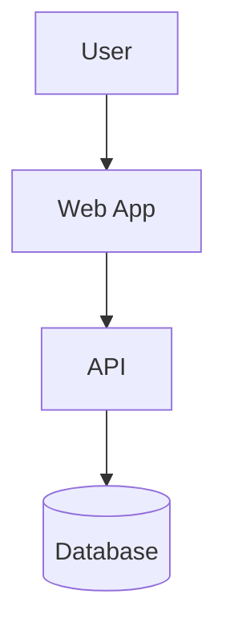
```mermaid
graph TB
    A[User] --> B[Web App]
    B --> C[API]
    C --> D[(Database)]
```

**Best Practices**:
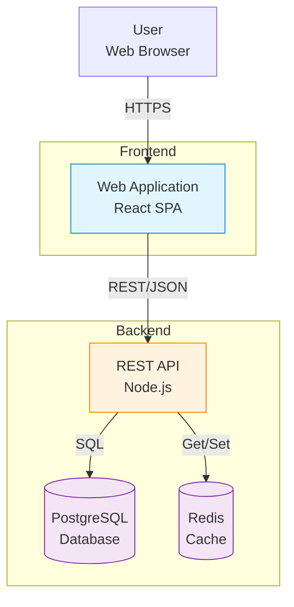
```mermaid
graph TB
    %% Use meaningful IDs and clear labels
    User[User<br/>Web Browser]
    WebApp[Web Application<br/>React SPA]
    API[REST API<br/>Node.js]
    DB[(PostgreSQL<br/>Database)]
    Cache[(Redis<br/>Cache)]
    
    %% Show clear data flow with labels
    User -->|HTTPS| WebApp
    WebApp -->|REST/JSON| API
    API -->|SQL| DB
    API -->|Get/Set| Cache
    
    %% Use subgraphs for grouping
    subgraph "Frontend"
        WebApp
    end
    
    subgraph "Backend"
        API
        DB
        Cache
    end
    
    %% Style for visual hierarchy
    classDef frontend fill:#e1f5ff,stroke:#0288d1
    classDef backend fill:#fff3e0,stroke:#f57c00
    classDef data fill:#f3e5f5,stroke:#7b1fa2
    
    class WebApp frontend
    class API backend
    class DB,Cache data
```

**Direction Options**:
- `graph TB` - Top to Bottom (default, hierarchical)
- `graph LR` - Left to Right (process flow)
- `graph BT` - Bottom to Top (layers, dependencies)
- `graph RL` - Right to Left (rare)

**When to use each**:
- **TB**: Layered architecture (UI → Logic → Data)
- **LR**: Sequential processes (order flow, CI/CD pipeline)
- **BT**: Dependency trees (what depends on what)

---

#### 2. Sequence Diagram (Interactions Over Time)

**When to use**: API calls, user workflows, distributed transactions

**Basic Syntax**:
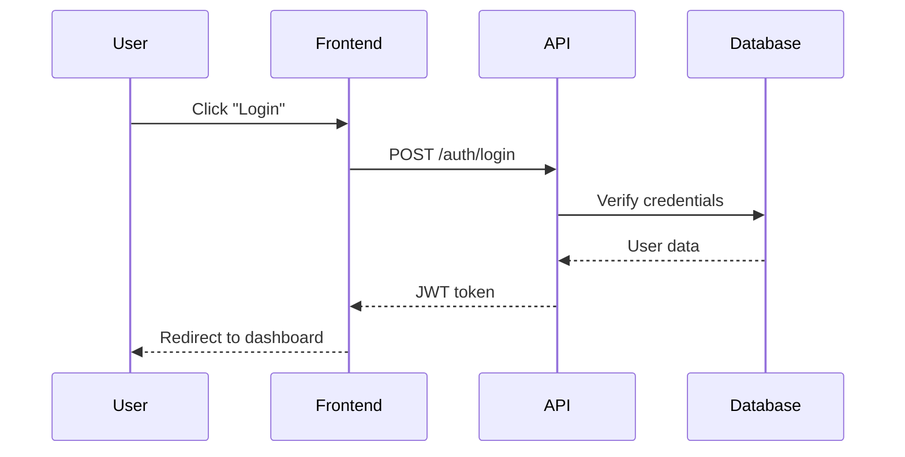
```mermaid
sequenceDiagram
    participant User
    participant Frontend
    participant API
    participant Database
    
    User->>Frontend: Click "Login"
    Frontend->>API: POST /auth/login
    API->>Database: Verify credentials
    Database-->>API: User data
    API-->>Frontend: JWT token
    Frontend-->>User: Redirect to dashboard
```

**Best Practices**:
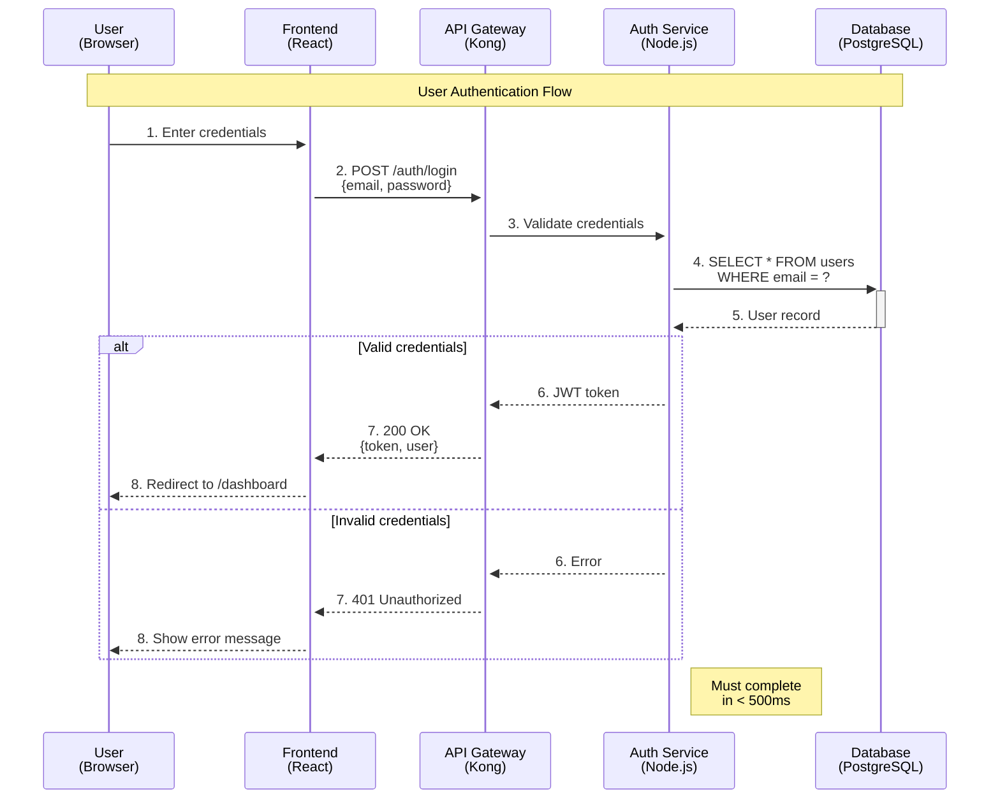
```mermaid
sequenceDiagram
    %% Use clear participant names
    participant U as User<br/>(Browser)
    participant FE as Frontend<br/>(React)
    participant API as API Gateway<br/>(Kong)
    participant Auth as Auth Service<br/>(Node.js)
    participant DB as Database<br/>(PostgreSQL)
    
    %% Add notes for context
    Note over U,DB: User Authentication Flow
    
    %% Show clear request/response
    U->>+FE: 1. Enter credentials
    FE->>+API: 2. POST /auth/login<br/>{email, password}
    API->>+Auth: 3. Validate credentials
    Auth->>+DB: 4. SELECT * FROM users<br/>WHERE email = ?
    DB-->>-Auth: 5. User record
    
    %% Show conditional logic
    alt Valid credentials
        Auth-->>API: 6. JWT token
        API-->>FE: 7. 200 OK<br/>{token, user}
        FE-->>U: 8. Redirect to /dashboard
    else Invalid credentials
        Auth-->>API: 6. Error
        API-->>FE: 7. 401 Unauthorized
        FE-->>U: 8. Show error message
    end
    
    %% Add timing constraints
    Note right of Auth: Must complete<br/>in < 500ms
```

**Advanced Features**:
- `activate/deactivate`: Show component lifecycle
- `alt/else/end`: Conditional flows
- `loop`: Repeated operations
- `par`: Parallel execution
- `rect`: Group related operations

---

#### 3. Class Diagram (Domain Model)

**When to use**: Domain entities, data models, object relationships

**Basic Syntax**:
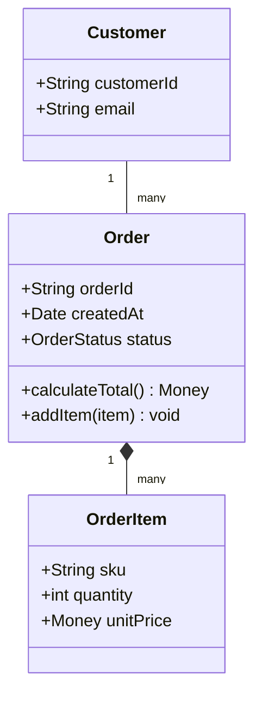
```mermaid
classDiagram
    class Order {
        +String orderId
        +Date createdAt
        +OrderStatus status
        +calculateTotal() Money
        +addItem(item) void
    }
    
    class OrderItem {
        +String sku
        +int quantity
        +Money unitPrice
    }
    
    class Customer {
        +String customerId
        +String email
    }
    
    Order "1" *-- "many" OrderItem
    Customer "1" -- "many" Order
```

**Best Practices**:
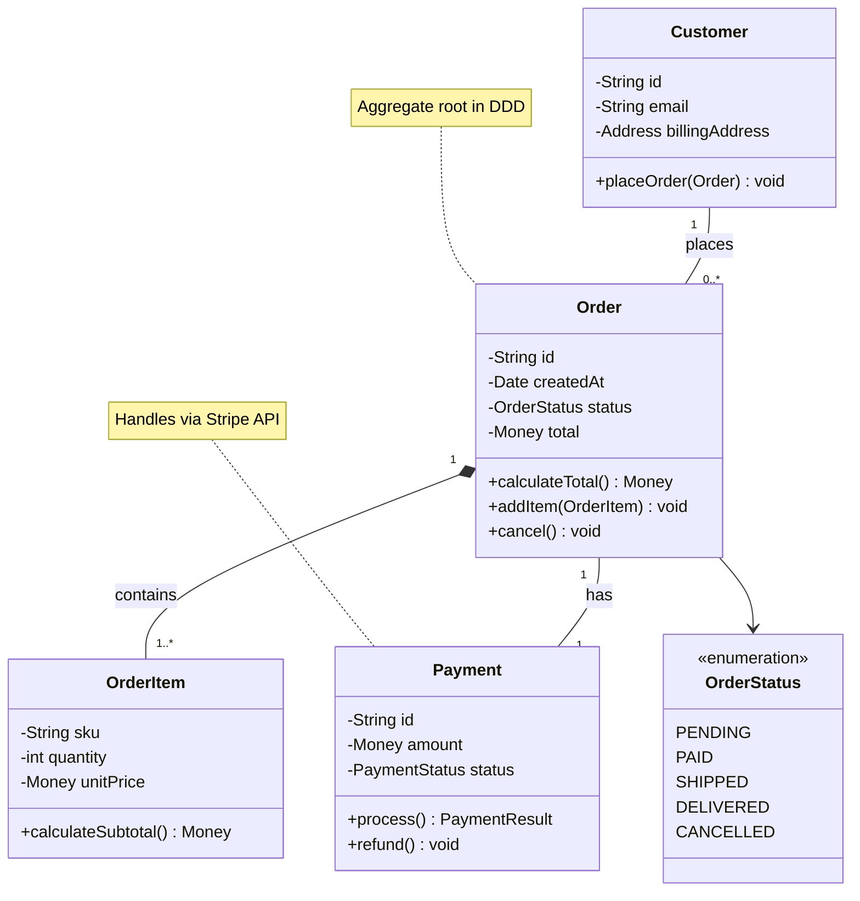
```mermaid
classDiagram
    %% Use clear naming and types
    class Order {
        -String id
        -Date createdAt
        -OrderStatus status
        -Money total
        +calculateTotal() Money
        +addItem(OrderItem) void
        +cancel() void
    }
    
    class OrderItem {
        -String sku
        -int quantity
        -Money unitPrice
        +calculateSubtotal() Money
    }
    
    class Customer {
        -String id
        -String email
        -Address billingAddress
        +placeOrder(Order) void
    }
    
    class Payment {
        -String id
        -Money amount
        -PaymentStatus status
        +process() PaymentResult
        +refund() void
    }
    
    %% Show relationships clearly
    Order "1" *-- "1..*" OrderItem : contains
    Customer "1" -- "0..*" Order : places
    Order "1" -- "1" Payment : has
    
    %% Use notes for important info
    note for Order "Aggregate root in DDD"
    note for Payment "Handles via Stripe API"
    
    %% Define status enums
    class OrderStatus {
        <<enumeration>>
        PENDING
        PAID
        SHIPPED
        DELIVERED
        CANCELLED
    }
    
    Order --> OrderStatus
```

**Relationship Types**:
- `--|>` : Inheritance
- `--*` : Composition (strong ownership)
- `--o` : Aggregation (weak ownership)
- `-->` : Association
- `--` : Link

---

#### 4. State Diagram (State Machines)

**When to use**: Order status, workflow states, process lifecycle

**Best Practices**:
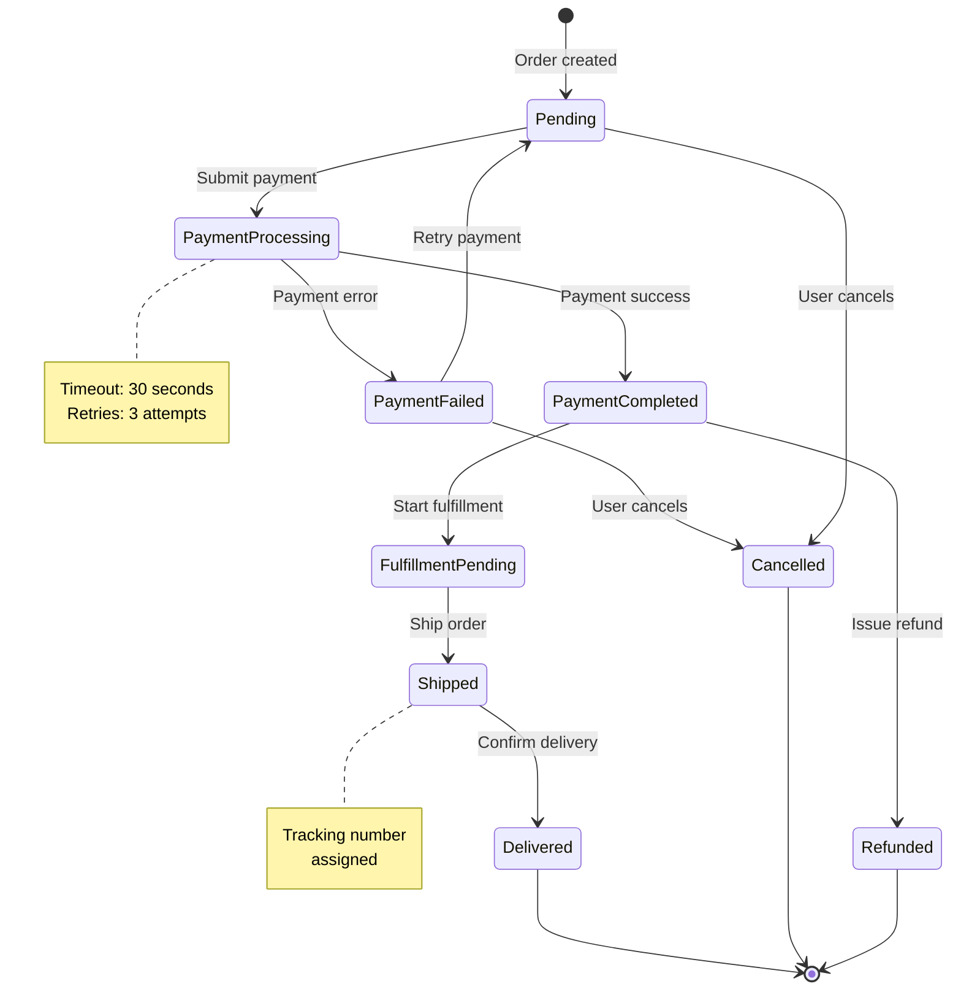
```mermaid
stateDiagram-v2
    [*] --> Pending: Order created
    
    Pending --> PaymentProcessing: Submit payment
    PaymentProcessing --> PaymentCompleted: Payment success
    PaymentProcessing --> PaymentFailed: Payment error
    
    PaymentFailed --> Cancelled: User cancels
    PaymentFailed --> Pending: Retry payment
    
    PaymentCompleted --> FulfillmentPending: Start fulfillment
    FulfillmentPending --> Shipped: Ship order
    Shipped --> Delivered: Confirm delivery
    
    Pending --> Cancelled: User cancels
    PaymentCompleted --> Refunded: Issue refund
    
    Delivered --> [*]
    Cancelled --> [*]
    Refunded --> [*]
    
    note right of PaymentProcessing
        Timeout: 30 seconds
        Retries: 3 attempts
    end note
    
    note right of Shipped
        Tracking number
        assigned
    end note
```

---

#### 5. Entity Relationship Diagram (Database Schema)

**When to use**: Database design, data model documentation

**Best Practices**:
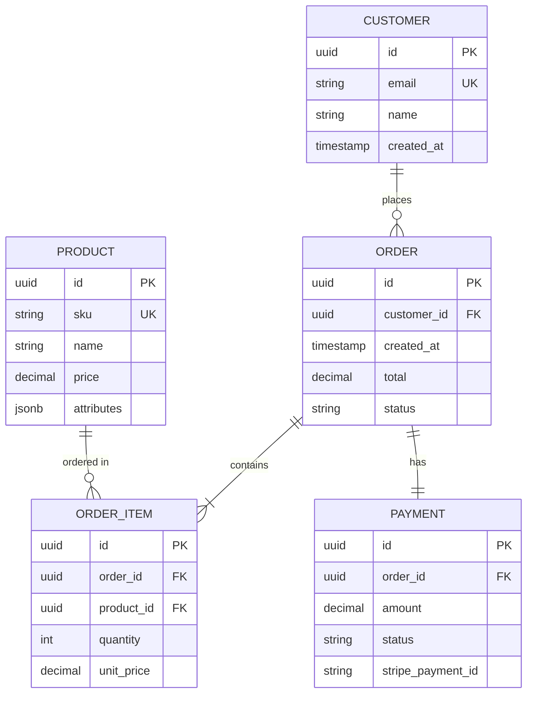
```mermaid
erDiagram
    CUSTOMER ||--o{ ORDER : places
    ORDER ||--|{ ORDER_ITEM : contains
    ORDER ||--|| PAYMENT : has
    PRODUCT ||--o{ ORDER_ITEM : "ordered in"
    
    CUSTOMER {
        uuid id PK
        string email UK
        string name
        timestamp created_at
    }
    
    ORDER {
        uuid id PK
        uuid customer_id FK
        timestamp created_at
        decimal total
        string status
    }
    
    ORDER_ITEM {
        uuid id PK
        uuid order_id FK
        uuid product_id FK
        int quantity
        decimal unit_price
    }
    
    PRODUCT {
        uuid id PK
        string sku UK
        string name
        decimal price
        jsonb attributes
    }
    
    PAYMENT {
        uuid id PK
        uuid order_id FK
        decimal amount
        string status
        string stripe_payment_id
    }
```

**Relationship Cardinality**:
- `||--||` : One to one
- `||--o{` : One to zero or many
- `||--|{` : One to one or many
- `}o--o{` : Zero or many to zero or many

---

#### 6. Git Graph (Version History)

**When to use**: Branching strategies, release planning

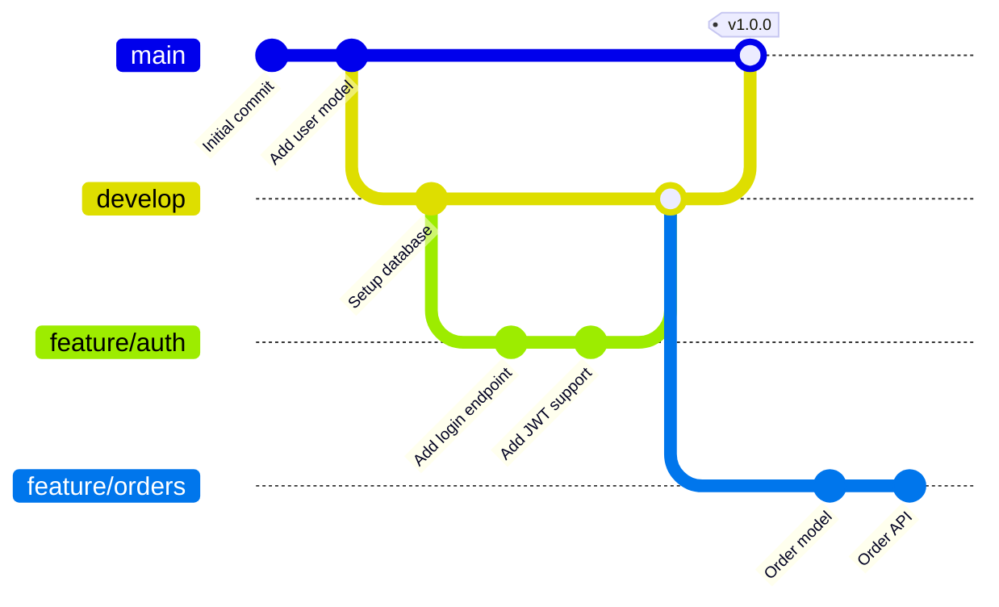
```mermaid
gitGraph
    commit id: "Initial commit"
    commit id: "Add user model"
    branch develop
    checkout develop
    commit id: "Setup database"
    branch feature/auth
    checkout feature/auth
    commit id: "Add login endpoint"
    commit id: "Add JWT support"
    checkout develop
    merge feature/auth
    checkout main
    merge develop tag: "v1.0.0"
    checkout develop
    branch feature/orders
    commit id: "Order model"
    commit id: "Order API"
```

---

## Advanced Mermaid Techniques

### 1. Styling and Theming

**Custom Colors**:
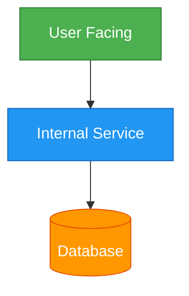
```mermaid
graph TB
    A[User Facing]
    B[Internal Service]
    C[(Database)]
    
    A --> B --> C
    
    classDef userFacing fill:#4CAF50,stroke:#2E7D32,color:#fff
    classDef internal fill:#2196F3,stroke:#1565C0,color:#fff
    classDef data fill:#FF9800,stroke:#E65100,color:#fff
    
    class A userFacing
    class B internal
    class C data
```

**Define Reusable Styles**:
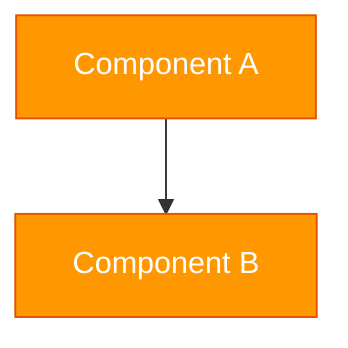
```mermaid
%%{init: {'theme':'base', 'themeVariables': { 'primaryColor':'#ff9800','primaryTextColor':'#fff','primaryBorderColor':'#e65100','lineColor':'#333','secondaryColor':'#2196f3','tertiaryColor':'#4caf50'}}}%%
graph TB
    A[Component A] --> B[Component B]
```

### 2. Subgraphs for Organization

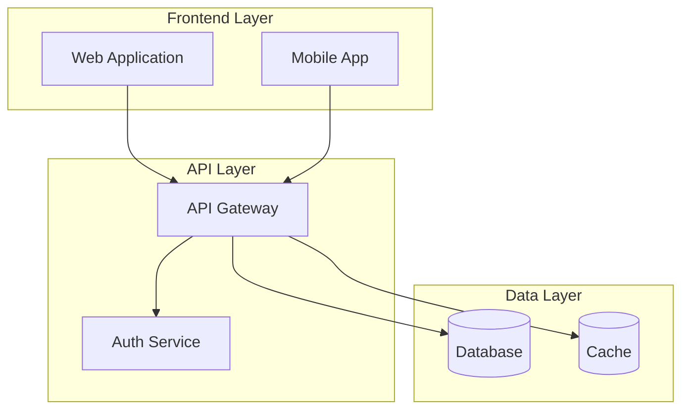
```mermaid
graph TB
    subgraph "Frontend Layer"
        WebApp[Web Application]
        MobileApp[Mobile App]
    end
    
    subgraph "API Layer"
        Gateway[API Gateway]
        Auth[Auth Service]
    end
    
    subgraph "Data Layer"
        DB[(Database)]
        Cache[(Cache)]
    end
    
    WebApp --> Gateway
    MobileApp --> Gateway
    Gateway --> Auth
    Gateway --> DB
    Gateway --> Cache
```

### 3. Links and Tooltips

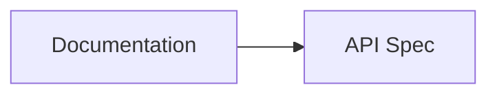
```mermaid
graph LR
    A[Documentation] --> B[API Spec]
    click A "https://docs.example.com" "View Documentation"
    click B "https://api.example.com/swagger" "View API Spec"
```

---

## Common Diagram Patterns

### Pattern 1: Layered Architecture

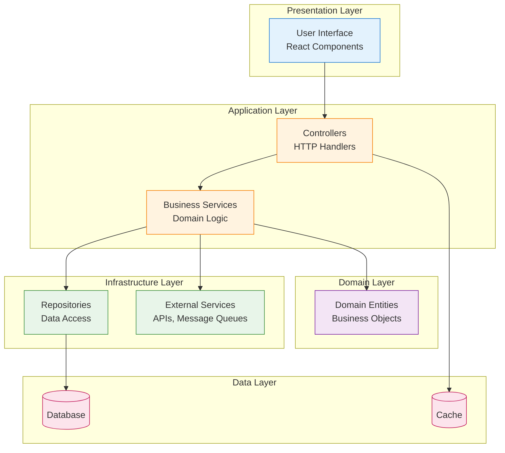
```mermaid
graph TB
    subgraph "Presentation Layer"
        UI[User Interface<br/>React Components]
    end
    
    subgraph "Application Layer"
        Controllers[Controllers<br/>HTTP Handlers]
        Services[Business Services<br/>Domain Logic]
    end
    
    subgraph "Domain Layer"
        Entities[Domain Entities<br/>Business Objects]
    end
    
    subgraph "Infrastructure Layer"
        Repos[Repositories<br/>Data Access]
        External[External Services<br/>APIs, Message Queues]
    end
    
    subgraph "Data Layer"
        DB[(Database)]
        Cache[(Cache)]
    end
    
    UI --> Controllers
    Controllers --> Services
    Services --> Entities
    Services --> Repos
    Repos --> DB
    Services --> External
    Controllers --> Cache
    
    classDef presentation fill:#e3f2fd,stroke:#1976d2
    classDef application fill:#fff3e0,stroke:#f57c00
    classDef domain fill:#f3e5f5,stroke:#7b1fa2
    classDef infrastructure fill:#e8f5e9,stroke:#388e3c
    classDef data fill:#fce4ec,stroke:#c2185b
    
    class UI presentation
    class Controllers,Services application
    class Entities domain
    class Repos,External infrastructure
    class DB,Cache data
```

### Pattern 2: Microservices Architecture

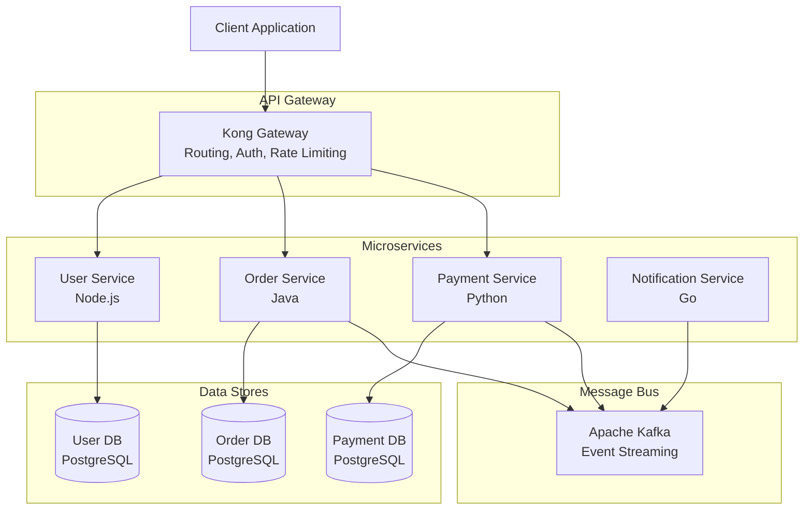
```mermaid
graph TB
    Client[Client Application]
    
    subgraph "API Gateway"
        Gateway[Kong Gateway<br/>Routing, Auth, Rate Limiting]
    end
    
    subgraph "Microservices"
        UserService[User Service<br/>Node.js]
        OrderService[Order Service<br/>Java]
        PaymentService[Payment Service<br/>Python]
        NotificationService[Notification Service<br/>Go]
    end
    
    subgraph "Data Stores"
        UserDB[(User DB<br/>PostgreSQL)]
        OrderDB[(Order DB<br/>PostgreSQL)]
        PaymentDB[(Payment DB<br/>PostgreSQL)]
    end
    
    subgraph "Message Bus"
        Kafka[Apache Kafka<br/>Event Streaming]
    end
    
    Client --> Gateway
    Gateway --> UserService
    Gateway --> OrderService
    Gateway --> PaymentService
    
    UserService --> UserDB
    OrderService --> OrderDB
    PaymentService --> PaymentDB
    
    OrderService --> Kafka
    PaymentService --> Kafka
    NotificationService --> Kafka
```

### Pattern 3: Event-Driven Flow

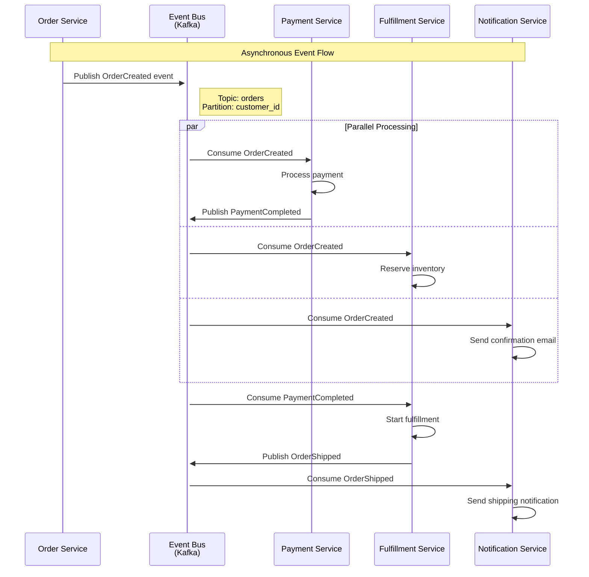
```mermaid
sequenceDiagram
    participant Order as Order Service
    participant Events as Event Bus<br/>(Kafka)
    participant Payment as Payment Service
    participant Fulfillment as Fulfillment Service
    participant Notification as Notification Service
    
    Note over Order,Notification: Asynchronous Event Flow
    
    Order->>+Events: Publish OrderCreated event
    Note right of Events: Topic: orders<br/>Partition: customer_id
    
    par Parallel Processing
        Events->>Payment: Consume OrderCreated
        Payment->>Payment: Process payment
        Payment->>Events: Publish PaymentCompleted
    and
        Events->>Fulfillment: Consume OrderCreated
        Fulfillment->>Fulfillment: Reserve inventory
    and
        Events->>Notification: Consume OrderCreated
        Notification->>Notification: Send confirmation email
    end
    
    Events->>Fulfillment: Consume PaymentCompleted
    Fulfillment->>Fulfillment: Start fulfillment
    Fulfillment->>Events: Publish OrderShipped
    
    Events->>Notification: Consume OrderShipped
    Notification->>Notification: Send shipping notification
```

### Pattern 4: Deployment Architecture

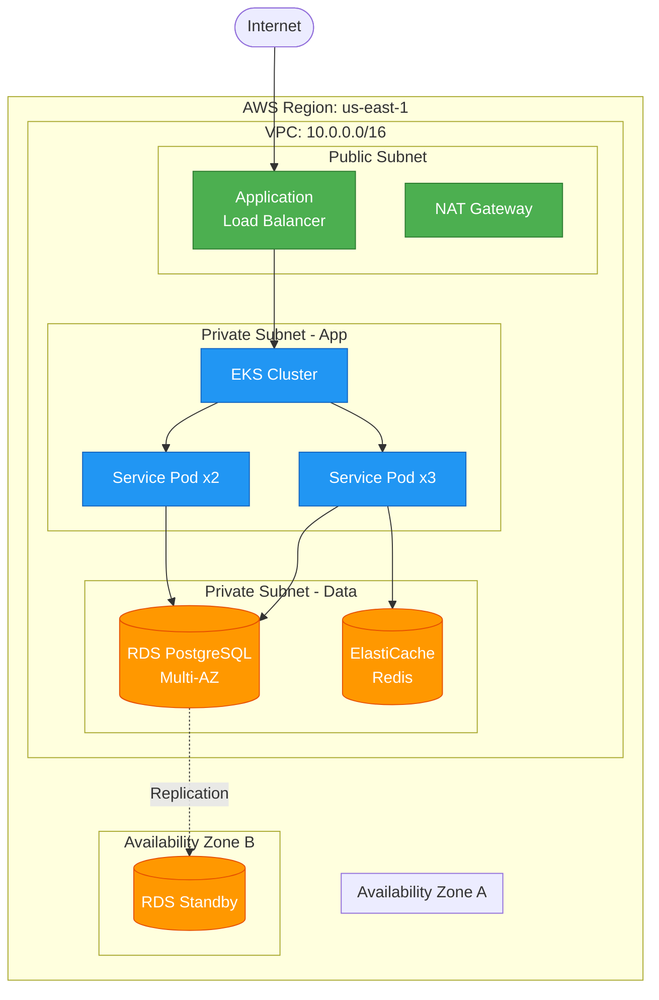
```mermaid
graph TB
    subgraph "AWS Region: us-east-1"
        subgraph "VPC: 10.0.0.0/16"
            subgraph "Public Subnet"
                ALB[Application<br/>Load Balancer]
                NAT[NAT Gateway]
            end
            
            subgraph "Private Subnet - App"
                EKS[EKS Cluster]
                App1[Service Pod x3]
                App2[Service Pod x2]
            end
            
            subgraph "Private Subnet - Data"
                RDS[(RDS PostgreSQL<br/>Multi-AZ)]
                ElastiCache[(ElastiCache<br/>Redis)]
            end
        end
        
        subgraph "Availability Zone A"
            RDS
        end
        
        subgraph "Availability Zone B"
            RDSStandby[(RDS Standby)]
        end
    end
    
    Internet([Internet]) --> ALB
    ALB --> EKS
    EKS --> App1
    EKS --> App2
    App1 --> RDS
    App2 --> RDS
    App1 --> ElastiCache
    
    RDS -.Replication.-> RDSStandby
    
    classDef public fill:#4caf50,stroke:#2e7d32,color:#fff
    classDef private fill:#2196f3,stroke:#1565c0,color:#fff
    classDef data fill:#ff9800,stroke:#e65100,color:#fff
    
    class ALB,NAT public
    class EKS,App1,App2 private
    class RDS,RDSStandby,ElastiCache data
```

---

## Diagram Anti-Patterns

### Anti-Pattern 1: Too Much Detail

❌ **Bad**: Everything in one diagram
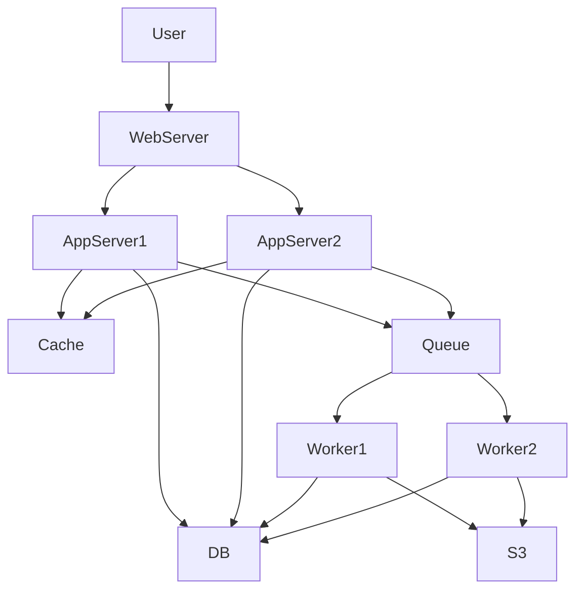
```mermaid
graph TB
    User[User] --> WebServer
    WebServer --> AppServer1
    WebServer --> AppServer2
    AppServer1 --> Cache
    AppServer2 --> Cache
    AppServer1 --> DB
    AppServer2 --> DB
    AppServer1 --> Queue
    AppServer2 --> Queue
    Queue --> Worker1
    Queue --> Worker2
    Worker1 --> DB
    Worker2 --> DB
    Worker1 --> S3
    Worker2 --> S3
    %% ... 20 more components
```

✅ **Good**: Multiple focused diagrams
- Diagram 1: User → Web → App → Data (high level)
- Diagram 2: App Server internals
- Diagram 3: Worker processing flow

### Anti-Pattern 2: Inconsistent Notation

❌ **Bad**: Different shapes for same concepts across diagrams
- Diagram 1: Database as cylinder
- Diagram 2: Database as rectangle
- Diagram 3: Database as database icon

✅ **Good**: Consistent notation throughout

### Anti-Pattern 3: No Labels on Relationships

❌ **Bad**:
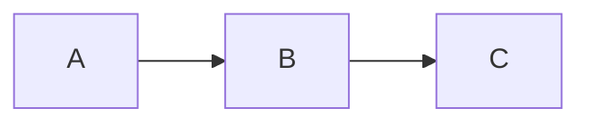
```mermaid
graph LR
    A --> B
    B --> C
```

✅ **Good**:
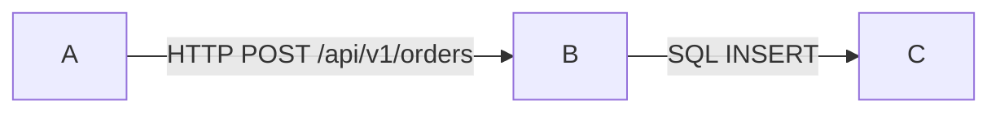
```mermaid
graph LR
    A -->|HTTP POST /api/v1/orders| B
    B -->|SQL INSERT| C
```

### Anti-Pattern 4: Colors Without Meaning

❌ **Bad**: Random colors just for aesthetics

✅ **Good**: Colors represent categories
- Blue = Frontend
- Orange = Backend
- Purple = Data
- Green = External

### Anti-Pattern 5: Missing Legend

When using custom notation, always include a legend:

```mermaid
graph TB
    subgraph "Legend"
        Internal[Internal Service]
        External[External Service]
        DB[(Database)]
        Sync[Sync Call] -->|→| Async
        Async[Async Message] -.->|⇢| End[End]
    end
    
    classDef internal fill:#2196f3,stroke:#1565c0,color:#fff
    classDef external fill:#ff9800,stroke:#e65100,color:#fff
    
    class Internal internal
    class External external
```

---

## PlantUML (Alternative to Mermaid)

### When to Use PlantUML

**Advantages over Mermaid**:
- More diagram types (timing, Gantt, mind maps)
- More customization options
- Better for complex class diagrams
- Better for large sequence diagrams

**Disadvantages**:
- Requires Java runtime
- Not natively supported in browsers
- Steeper learning curve

### PlantUML Syntax Examples

#### Sequence Diagram
```plantuml
@startuml
participant User
participant "Web App" as Web
participant "API Gateway" as API
participant "Auth Service" as Auth
database "PostgreSQL" as DB

User -> Web: Login
Web -> API: POST /auth/login
API -> Auth: Validate credentials
Auth -> DB: SELECT * FROM users
DB --> Auth: User data
Auth --> API: JWT token
API --> Web: 200 OK + token
Web --> User: Redirect to dashboard

note right of Auth
  Token expires in 1 hour
  Refresh token valid for 7 days
end note
@enduml
```

#### Component Diagram
```plantuml
@startuml
package "Frontend" {
  [Web Application]
  [Mobile App]
}

package "Backend" {
  [API Gateway]
  [User Service]
  [Order Service]
  [Payment Service]
}

database "PostgreSQL" {
  [User DB]
  [Order DB]
  [Payment DB]
}

[Web Application] --> [API Gateway]
[Mobile App] --> [API Gateway]
[API Gateway] --> [User Service]
[API Gateway] --> [Order Service]
[API Gateway] --> [Payment Service]

[User Service] --> [User DB]
[Order Service] --> [Order DB]
[Payment Service] --> [Payment DB]
@enduml
```

---

## Diagram Checklist

Before finalizing a diagram, check:

### Content
- [ ] Diagram has a clear title
- [ ] Purpose/question is obvious
- [ ] Audience is appropriate
- [ ] All elements are labeled
- [ ] Relationships are labeled (not just arrows)
- [ ] Legend included if custom notation used
- [ ] Technical details appropriate to level
- [ ] No unnecessary elements

### Visual
- [ ] Layout is logical (top-to-bottom or left-to-right flow)
- [ ] Related items are grouped (subgraphs/boundaries)
- [ ] Colors are consistent and meaningful
- [ ] 5-9 main elements (not overwhelming)
- [ ] Adequate white space
- [ ] Font size readable
- [ ] Arrows don't cross unnecessarily

### Technical
- [ ] Diagram renders correctly
- [ ] Source is version controlled
- [ ] Syntax is valid (no errors)
- [ ] Uses standard notation when possible
- [ ] Links to related diagrams included
- [ ] Date/version on diagram (if long-lived)

---

## Tools & Resources

### Diagram Tools

**Mermaid**:
- [Mermaid Live Editor](https://mermaid.live/) - Online editor
- [Mermaid CLI](https://github.com/mermaid-js/mermaid-cli) - Generate images
- [VS Code Extension](https://marketplace.visualstudio.com/items?itemName=bierner.markdown-mermaid) - Preview in editor

**PlantUML**:
- [PlantUML Online](http://www.plantuml.com/plantuml/) - Online editor
- [PlantUML CLI](https://plantuml.com/command-line) - Generate images
- [VS Code Extension](https://marketplace.visualstudio.com/items?itemName=jebbs.plantuml) - Preview in editor

**General Purpose**:
- [Draw.io](https://www.diagrams.net/) - Free, browser-based
- [Lucidchart](https://www.lucidchart.com/) - Commercial, collaborative
- [Excalidraw](https://excalidraw.com/) - Hand-drawn style
- [Structurizr](https://structurizr.com/) - C4 Model specific

### Documentation Integration

**Markdown + Mermaid**:
- GitHub (native support)
- GitLab (native support)
- Notion (native support)
- Confluence (via plugin)
- MkDocs (via plugin)
- Docusaurus (via plugin)

**Export Options**:
```bash
# Mermaid CLI - Generate PNG
mmdc -i diagram.mmd -o diagram.png

# PlantUML - Generate SVG
plantuml -tsvg diagram.puml
```

---

## Mermaid vs PlantUML: Quick Comparison

| Feature | Mermaid | PlantUML |
|---------|---------|----------|
| **Browser Support** | ✅ Native | ❌ Requires server |
| **GitHub/GitLab** | ✅ Native | ❌ Plugin needed |
| **Learning Curve** | ✅ Easy | ⚠️ Moderate |
| **Sequence Diagrams** | ✅ Good | ✅ Excellent |
| **Class Diagrams** | ⚠️ Basic | ✅ Excellent |
| **Deployment Diagrams** | ⚠️ Limited | ✅ Good |
| **Styling Options** | ⚠️ Limited | ✅ Extensive |
| **Large Diagrams** | ⚠️ Can be slow | ✅ Good |
| **Diagram Types** | ⚠️ 10+ types | ✅ 20+ types |

**Recommendation**:
- **Use Mermaid** for: Documentation in GitHub/GitLab, simple diagrams, fast iteration
- **Use PlantUML** for: Complex class diagrams, detailed sequence diagrams, print-quality output

---

## Real-World Examples

### Example 1: Authentication Flow (Stakeholder: Security Team)

```mermaid
sequenceDiagram
    autonumber
    actor User
    participant Browser
    participant Gateway as API Gateway<br/>(Kong)
    participant Auth as Auth Service
    participant DB as User DB<br/>(PostgreSQL)
    participant Redis as Session Cache<br/>(Redis)
    
    Note over User,Redis: OAuth 2.0 Authorization Code Flow
    
    User->>Browser: 1. Click "Login with Google"
    Browser->>Gateway: 2. GET /auth/google
    Gateway->>Auth: 3. Initiate OAuth flow
    Auth-->>Browser: 4. Redirect to Google
    
    Browser->>Google: 5. Google login page
    User->>Google: 6. Enter credentials
    Google-->>Browser: 7. Redirect with auth code
    
    Browser->>Gateway: 8. GET /auth/callback?code=xxx
    Gateway->>Auth: 9. Exchange code for token
    Auth->>Google: 10. POST /token
    Google-->>Auth: 11. Access token + user info
    
    Auth->>DB: 12. SELECT/INSERT user
    DB-->>Auth: 13. User record
    
    Auth->>Redis: 14. Store session (TTL: 1h)
    Auth-->>Gateway: 15. JWT token
    Gateway-->>Browser: 16. Set-Cookie: token
    Browser-->>User: 17. Redirect to dashboard
    
    rect rgb(255, 200, 200)
        Note over Auth,DB: Sensitive: PII data<br/>Encrypted at rest (AES-256)
    end
    
    rect rgb(200, 255, 200)
        Note over Gateway,Redis: Token validation<br/>< 10ms p95
    end
```

### Example 2: Deployment (Stakeholder: Operations Team)

```mermaid
graph TB
    subgraph "AWS us-east-1"
        subgraph "Public Subnet (10.0.1.0/24)"
            Internet([Internet<br/>Users])
            Route53[Route53<br/>DNS]
            CloudFront[CloudFront CDN<br/>Static Assets]
            ALB[Application Load Balancer<br/>HTTPS:443]
        end
        
        subgraph "Private Subnet - App (10.0.10.0/24)"
            EKS[Amazon EKS<br/>Kubernetes 1.28]
            
            subgraph "EKS Pods"
                API1[API Pod 1<br/>Node.js v20]
                API2[API Pod 2<br/>Node.js v20]
                API3[API Pod 3<br/>Node.js v20]
                Worker1[Worker Pod<br/>Python 3.11]
                Worker2[Worker Pod<br/>Python 3.11]
            end
        end
        
        subgraph "Private Subnet - Data (10.0.20.0/24)"
            RDS[(RDS PostgreSQL 15<br/>db.r6g.xlarge<br/>Multi-AZ)]
            ElastiCache[(ElastiCache Redis 7<br/>cache.r6g.large<br/>3-node cluster)]
            S3[(S3 Bucket<br/>User Uploads)]
        end
        
        subgraph "Monitoring"
            CloudWatch[CloudWatch<br/>Metrics + Logs]
            Datadog[Datadog<br/>APM + Tracing]
        end
    end
    
    Internet --> Route53
    Route53 --> CloudFront
    Route53 --> ALB
    ALB --> EKS
    EKS --> API1 & API2 & API3
    EKS --> Worker1 & Worker2
    
    API1 & API2 & API3 --> RDS
    API1 & API2 & API3 --> ElastiCache
    API1 & API2 & API3 --> S3
    Worker1 & Worker2 --> RDS
    Worker1 & Worker2 --> S3
    
    API1 & API2 & API3 & Worker1 & Worker2 --> CloudWatch
    API1 & API2 & API3 & Worker1 & Worker2 --> Datadog
    
    classDef public fill:#4caf50,stroke:#2e7d32,color:#fff,stroke-width:2px
    classDef compute fill:#2196f3,stroke:#1565c0,color:#fff,stroke-width:2px
    classDef data fill:#ff9800,stroke:#e65100,color:#fff,stroke-width:2px
    classDef monitor fill:#9c27b0,stroke:#6a1b9a,color:#fff,stroke-width:2px
    
    class Internet,Route53,CloudFront,ALB public
    class EKS,API1,API2,API3,Worker1,Worker2 compute
    class RDS,ElastiCache,S3 data
    class CloudWatch,Datadog monitor
    
    %% Annotations
    Note1[Autoscaling: 3-10 pods<br/>CPU > 70% triggers scale]
    Note2[Backup: Daily snapshots<br/>PITR enabled<br/>7-day retention]
```

### Example 3: Domain Model (Stakeholder: Developers)

```mermaid
classDiagram
    class Order {
        <<Aggregate Root>>
        -UUID id
        -CustomerId customerId
        -OrderStatus status
        -Money total
        -DateTime createdAt
        -List~OrderItem~ items
        +calculateTotal() Money
        +addItem(OrderItem) void
        +removeItem(OrderItem) void
        +cancel() void
        +canBeCancelled() boolean
    }
    
    class OrderItem {
        <<Entity>>
        -UUID id
        -ProductId productId
        -int quantity
        -Money unitPrice
        +calculateSubtotal() Money
        +changeQuantity(int) void
    }
    
    class Customer {
        <<Aggregate Root>>
        -UUID id
        -Email email
        -String name
        -Address shippingAddress
        -List~PaymentMethod~ paymentMethods
        +placeOrder(Order) void
        +addPaymentMethod(PaymentMethod) void
    }
    
    class Payment {
        <<Aggregate Root>>
        -UUID id
        -OrderId orderId
        -Money amount
        -PaymentStatus status
        -String stripePaymentId
        +process() PaymentResult
        +refund(Money) void
        +capture() void
    }
    
    class PaymentResult {
        <<Value Object>>
        +boolean success
        +String transactionId
        +String errorMessage
    }
    
    class Money {
        <<Value Object>>
        -decimal amount
        -Currency currency
        +add(Money) Money
        +subtract(Money) Money
        +multiply(decimal) Money
    }
    
    class OrderStatus {
        <<Enumeration>>
        DRAFT
        PENDING_PAYMENT
        PAID
        PROCESSING
        SHIPPED
        DELIVERED
        CANCELLED
        REFUNDED
    }
    
    class PaymentStatus {
        <<Enumeration>>
        PENDING
        PROCESSING
        SUCCEEDED
        FAILED
        REFUNDED
    }
    
    %% Relationships
    Order "1" *-- "1..*" OrderItem : contains
    Order --> OrderStatus : has
    Order --> Money : total
    
    Customer "1" -- "0..*" Order : places
    
    Payment "1" -- "1" Order : for
    Payment --> PaymentStatus : has
    Payment --> Money : amount
    Payment --> PaymentResult : produces
    
    OrderItem --> Money : unitPrice
    
    %% Notes
    note for Order "Enforces invariant:<br/>total = sum of items<br/>Cannot cancel if shipped"
    note for Payment "Idempotent operations<br/>Retry-safe with<br/>idempotency key"
    note for Money "Immutable<br/>Thread-safe<br/>Handles currency<br/>conversion"
```

---

## Documentation Generation Tips

### Tip 1: Diagram-Driven Documentation

Start with diagrams, add text explanations:

```markdown
# System Architecture

## Overview
[Brief text description]

## System Context
[Mermaid context diagram]

### Description
The system interacts with three main external actors:
- **Users**: Access via web and mobile applications
- **Payment Gateway**: Stripe API for payment processing
- **Email Service**: SendGrid for transactional emails

## Container Architecture
[Mermaid container diagram]

### Technology Choices
- **Frontend**: React 18 for component reusability
- **API**: Node.js for async I/O performance
- **Database**: PostgreSQL for ACID guarantees
```

### Tip 2: Living Diagrams

Keep diagrams in version control alongside code:

```
repo/
├── src/
├── docs/
│   ├── architecture/
│   │   ├── context.mmd
│   │   ├── containers.mmd
│   │   ├── components-api.mmd
│   │   ├── deployment.mmd
│   │   └── README.md (combines all diagrams)
```

### Tip 3: Automated Diagram Generation

Generate diagrams from code or configuration:

```javascript
// Example: Generate sequence diagram from OpenAPI spec
const openapi = require('./openapi.json');
const endpoints = openapi.paths['/orders']['post'];

console.log('sequenceDiagram');
console.log('  User->>API: POST /orders');
// ... generate rest based on spec
```

### Tip 4: Diagram Versioning

Include version info in diagrams:

```mermaid
graph TB
    Title[Order Management System Architecture]
    Version[Version: 2.0<br/>Date: 2024-10-30<br/>Status: Current]
    
    Title -.-> Version
    
    %% Rest of diagram
```

---

## Accessibility in Diagrams

### 1. Alt Text
Always provide text description:

```markdown


**Description**: The Order Management System is used by Customers 
(via web/mobile) and Administrators (via admin portal). It integrates 
with Stripe for payments and SendGrid for email notifications.
```

### 2. High Contrast
Ensure colors have sufficient contrast:

```mermaid
graph TB
    A[Component A]
    B[Component B]
    
    %% Good contrast ratios
    classDef highContrast fill:#1976d2,stroke:#0d47a1,color:#fff
    class A,B highContrast
```

### 3. Text Alternatives
Supplement visual diagrams with text:

```markdown
## Data Flow

### Visual Representation
[Diagram here]

### Text Description
1. User submits order through Web App
2. Web App sends POST request to API Gateway
3. API Gateway routes to Order Service
4. Order Service writes to PostgreSQL Database
5. Order Service publishes event to Kafka
6. Payment Service consumes event and processes payment
```

---

## Performance Considerations

### Mermaid Performance

**Large Diagrams**: Can be slow in browser

❌ **Avoid**: 50+ nodes in single diagram
✅ **Do**: Split into multiple focused diagrams

**Optimization Tips**:
- Limit subgraph nesting (max 3 levels)
- Reduce arrow crossings (better layout)
- Use simpler shapes (rectangles faster than rounded)

### Image Export

**For large documentation**:
- Export diagrams to PNG/SVG
- Include both source (.mmd) and rendered image
- CI/CD can auto-generate on commit

```yaml
# GitHub Actions example
name: Generate Diagrams
on: [push]
jobs:
  diagrams:
    runs-on: ubuntu-latest
    steps:
      - uses: actions/checkout@v2
      - name: Generate diagrams
        run: |
          npm install -g @mermaid-js/mermaid-cli
          mmdc -i docs/architecture/*.mmd -o docs/architecture/
```

---

## Common Use Cases & Templates

### Use Case 1: API Documentation

```mermaid
sequenceDiagram
    participant Client
    participant Gateway as API Gateway
    participant Service as Order Service
    participant DB as Database
    
    Note over Client,DB: POST /api/v1/orders
    
    Client->>+Gateway: POST /api/v1/orders<br/>Authorization: Bearer {token}<br/>Body: {"items": [...]}
    
    Gateway->>Gateway: Validate JWT
    Gateway->>Gateway: Rate limit check
    
    alt Valid request
        Gateway->>+Service: Forward request
        Service->>Service: Validate business rules
        Service->>+DB: BEGIN TRANSACTION
        Service->>DB: INSERT INTO orders
        Service->>DB: INSERT INTO order_items
        DB-->>-Service: Success
        Service->>DB: COMMIT
        Service-->>-Gateway: 201 Created<br/>Body: {"orderId": "..."}
        Gateway-->>-Client: 201 Created<br/>Body: {"orderId": "..."}
    else Invalid token
        Gateway-->>Client: 401 Unauthorized
    else Rate limit exceeded
        Gateway-->>Client: 429 Too Many Requests
    else Validation error
        Service-->>Gateway: 400 Bad Request
        Gateway-->>Client: 400 Bad Request
    end
    
    Note right of Service: Idempotency key prevents<br/>duplicate orders
```

### Use Case 2: Troubleshooting Guide

```mermaid
graph TB
    Start([User reports: Order not processing])
    
    CheckStatus{Check order status<br/>in database}
    
    StatusPending[Status: PENDING]
    StatusFailed[Status: PAYMENT_FAILED]
    StatusStuck[Status: PROCESSING > 5min]
    
    CheckPayment{Check payment service logs}
    CheckQueue{Check message queue}
    
    PaymentTimeout[Payment timeout]
    PaymentDeclined[Card declined]
    QueueBacklog[Queue backlog > 10K]
    QueueConsumerDead[Consumer pod crashed]
    
    FixTimeout[Retry payment with<br/>exponential backoff]
    FixDeclined[User needs to<br/>update payment method]
    FixBacklog[Scale up consumers<br/>kubectl scale deployment]
    FixCrashed[Restart consumer pod<br/>Check logs for root cause]
    
    Start --> CheckStatus
    CheckStatus -->|PENDING| StatusPending
    CheckStatus -->|PAYMENT_FAILED| StatusFailed
    CheckStatus -->|PROCESSING| StatusStuck
    
    StatusPending --> CheckPayment
    StatusFailed --> CheckPayment
    StatusStuck --> CheckQueue
    
    CheckPayment -->|Timeout| PaymentTimeout
    CheckPayment -->|Declined| PaymentDeclined
    CheckQueue -->|High| QueueBacklog
    CheckQueue -->|No consumers| QueueConsumerDead
    
    PaymentTimeout --> FixTimeout
    PaymentDeclined --> FixDeclined
    QueueBacklog --> FixBacklog
    QueueConsumerDead --> FixCrashed
    
    classDef problem fill:#ff5252,stroke:#d32f2f,color:#fff
    classDef check fill:#ffc107,stroke:#ffa000,color:#000
    classDef fix fill:#4caf50,stroke:#388e3c,color:#fff
    
    class StatusPending,StatusFailed,StatusStuck,PaymentTimeout,PaymentDeclined,QueueBacklog,QueueConsumerDead problem
    class CheckStatus,CheckPayment,CheckQueue check
    class FixTimeout,FixDeclined,FixBacklog,FixCrashed fix
```

### Use Case 3: Migration Plan

```mermaid
gantt
    title Legacy to Microservices Migration
    dateFormat  YYYY-MM-DD
    section Phase 1: Preparation
    Architecture design           :done,    des1, 2024-01-01,2024-01-31
    Team training                :done,    des2, 2024-02-01,2024-02-14
    CI/CD pipeline setup         :done,    des3, 2024-02-15,2024-02-28
    
    section Phase 2: Extract Services
    User service extraction      :active,  dev1, 2024-03-01,2024-04-15
    Payment service extraction   :         dev2, 2024-04-16,2024-05-31
    Order service extraction     :         dev3, 2024-06-01,2024-07-31
    
    section Phase 3: Migration
    Dual-write period           :         mig1, 2024-08-01,2024-08-31
    Traffic cutover             :crit,    mig2, 2024-09-01,2024-09-07
    Legacy monitoring           :         mig3, 2024-09-08,2024-10-31
    
    section Phase 4: Cleanup
    Legacy decommission         :         clean, 2024-11-01,2024-11-30
```

---

## Quick Reference: When to Use Each Diagram Type

| Diagram Type | Best For | Avoid For |
|-------------|----------|-----------|
| **Flowchart** | System structure, component relationships | Detailed interactions over time |
| **Sequence** | API calls, user workflows, distributed transactions | Static structure, many participants |
| **Class** | Domain model, data structure, object relationships | Runtime behavior, deployment |
| **State** | Order status, workflow states, process lifecycle | System architecture, integrations |
| **ER Diagram** | Database schema, data relationships | Application logic, APIs |
| **Gantt** | Project timelines, migration phases | Technical architecture |
| **Git Graph** | Branching strategy, release process | System design |

---

## Summary: Diagram Excellence

### The 5 Principles of Great Diagrams

1. **Purpose-Driven**: Every diagram answers a specific question
2. **Audience-Appropriate**: Match detail level to stakeholder needs
3. **Visually Clear**: Use layout, grouping, and color meaningfully
4. **Consistent**: Same notation across all your diagrams
5. **Maintainable**: Version controlled, easy to update

### Essential Practices

✅ **Do**:
- Start with context, drill down progressively
- Label all relationships (not just arrows)
- Use subgraphs to group related items
- Include a legend for custom notation
- Keep it simple (5-9 elements per diagram)
- Version control diagram source code
- Export to images for performance

❌ **Don't**:
- Put everything in one diagram
- Use colors randomly
- Skip labels on arrows
- Mix abstraction levels
- Create diagrams that can't be maintained
- Forget the target audience
- Use obscure notation without explanation

### When Creating a Diagram, Ask:

1. **What question does this answer?**
2. **Who will read this?**
3. **What's the right level of detail?**
4. **Is this consistent with other diagrams?**
5. **Can someone update this in 6 months?**

---

## Final Checklist

Before publishing a diagram:

**Content**:
- [ ] Clear title describing what it shows
- [ ] All elements labeled
- [ ] All relationships labeled
- [ ] Legend included (if needed)
- [ ] Appropriate level of detail for audience

**Visual**:
- [ ] Logical layout (flow is clear)
- [ ] Related items grouped
- [ ] Adequate white space
- [ ] Consistent with other diagrams
- [ ] 5-9 main elements (not overwhelming)

**Technical**:
- [ ] Renders correctly in target environment
- [ ] Source file in version control
- [ ] Syntax validated
- [ ] Alternative text provided (accessibility)

**Process**:
- [ ] Reviewed by at least one other person
- [ ] Linked from relevant documentation
- [ ] Date/version included
- [ ] Update process documented

---

## Resources

### Learning Resources
- [Mermaid Documentation](https://mermaid.js.org/)
- [PlantUML Documentation](https://plantuml.com/)
- [C4 Model](https://c4model.com/)
- [UML Distilled (Martin Fowler)](https://martinfowler.com/books/uml.html)
- [The Visual Display of Quantitative Information (Edward Tufte)](https://www.edwardtufte.com/tufte/books_vdqi)

### Tools
- [Mermaid Live Editor](https://mermaid.live/)
- [PlantUML Online Server](http://www.plantuml.com/plantuml/)
- [Structurizr](https://structurizr.com/) - C4 Model tool
- [IcePanel](https://icepanel.io/) - Collaborative architecture diagrams
- [Diagrams.net (Draw.io)](https://www.diagrams.net/)

### VS Code Extensions
- Markdown Preview Mermaid Support
- PlantUML
- Draw.io Integration

### Style Guides
- [Google's Technical Writing Style Guide](https://developers.google.com/style/images)
- [Microsoft's Diagram Standards](https://docs.microsoft.com/en-us/style-guide/procedures-instructions/text-formatting)

---

**End of Diagram Best Practices Guide**

Use this guide when creating architecture diagrams to ensure clarity, consistency, and effectiveness in communicating technical concepts to diverse stakeholders.